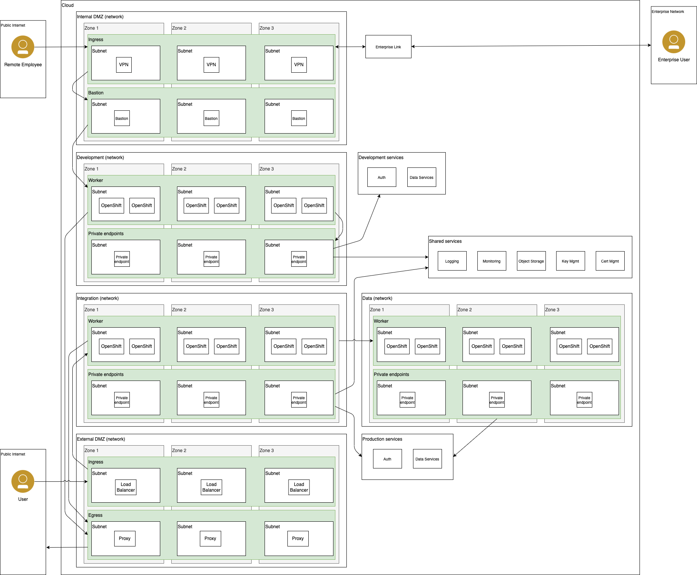

# Reference Architectures

The reference architectures are provided in three different forms, with increasing security and associated complexity. These three forms are:

- **Quick Start** - a simple architecture to quickly get an OpenShift cluster provisioned
- **Standard** - a standard production deployment environment with typical security protections, private endpoints, VPN server, key management encryption, etc
- **Advanced** - a more advanced deployment that employs network isolation to securely route traffic between the different layers.

For each of these reference architecture forms, we have provided a detailed reference architecture on the different hyper-scalers.

|                                   | Quick Start                                              | Standard                                            | Advanced                                            | Source diagram                                           | 
|-----------------------------------|----------------------------------------------------------|-----------------------------------------------------|-----------------------------------------------------|----------------------------------------------------------|
| [IBM Cloud](ibmcloud/ibmcloud.md) | [IBM Cloud Quick Start](ibmcloud/ibmcloud-quickstart.md) | [IBM Cloud Standard](ibmcloud/ibmcloud-standard.md) | [IBM Cloud Advanced](ibmcloud/ibmcloud-advanced.md) | [IBM Cloud arch](ibmcloud/ibm-cloud-architecture.drawio) |
| [AWS](aws/aws.md)                 | [AWS Quick Start](aws/aws-quickstart.md)                 | [AWS Standard](aws/aws-standard.md)                 | [AWS Advanced](aws/aws-advanced.md)                 | [AWS arch](aws/aws-cloud-architecture-0.7.drawio)        |
| [Azure](azure/azure.md)           | [Azure Quick Start](azure/azure-quickstart.md)           | [Azure Standard](azure/azure-standard.md)           | [Azure Advanced](azure/azure-advanced.md)           | [Azure arch](azure/azure-ref-arch.drawio)                |
| VMWare                            | Pending                                                  | Pending                                             | Pending                                             | Pending                                                  |

## Architectures

### Advanced

