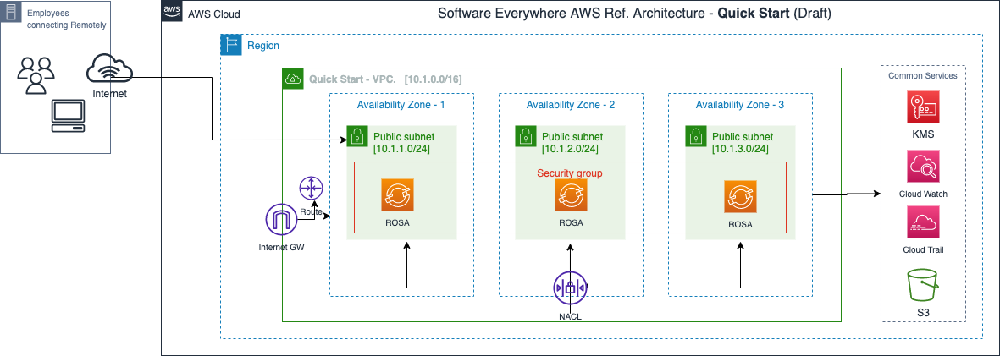
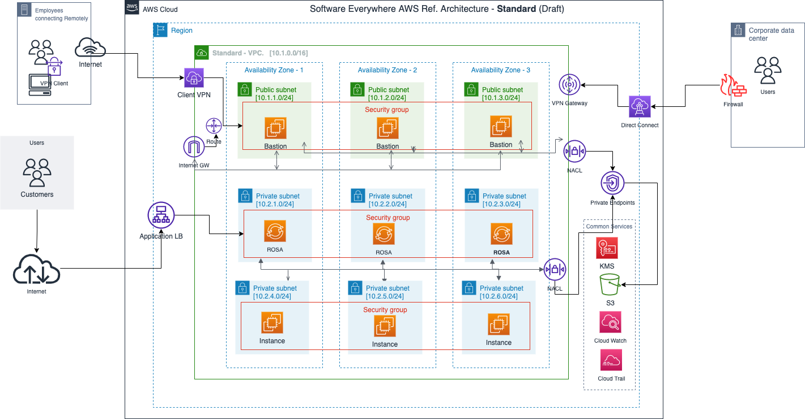
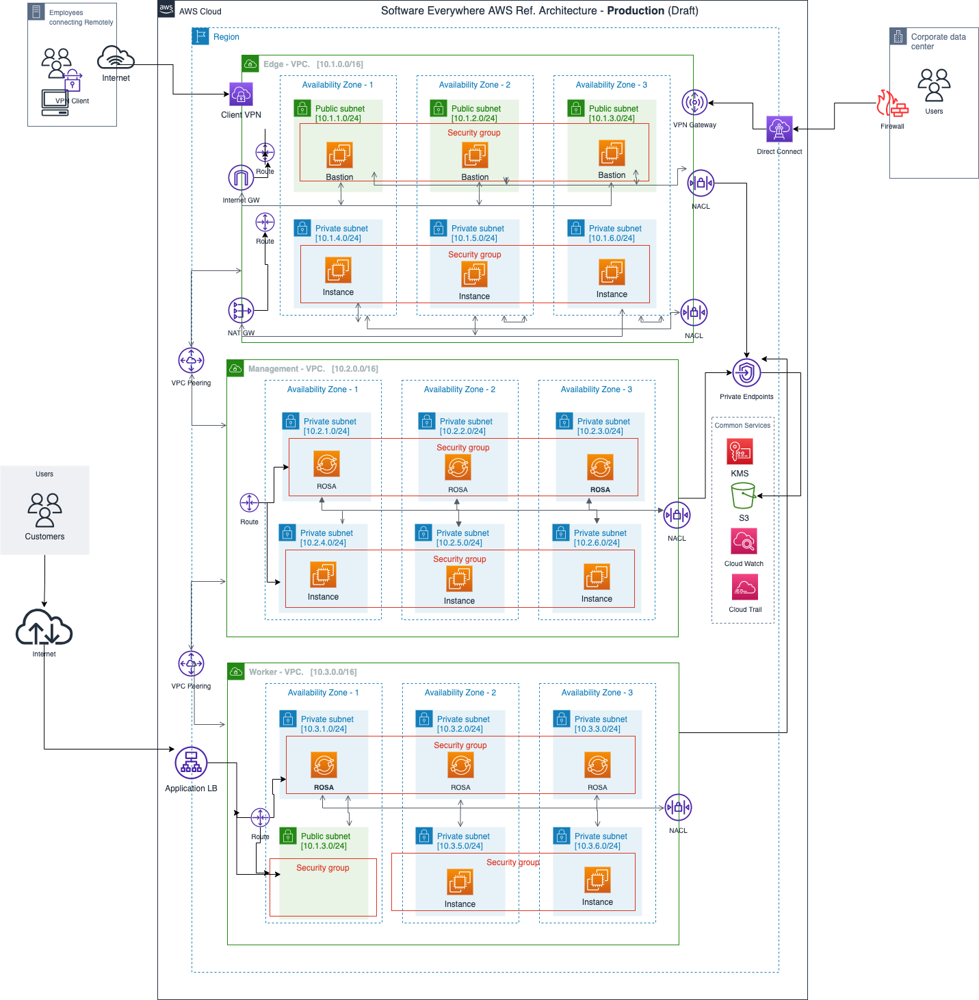

# AWS OpenShift Reference Architectures

The reference architectures are provided in three different forms, with increasing security and associated complexity. The source of these reference architecture diagrams can be found [here](https://github.com/cloud-native-toolkit/automation-solutions/blob/main/architectures/aws-cloud-architecture-0.7.drawio)

**Draft**

## Quick Start

As the name suggests, Quick Start provides a simple architecture intended to get up and running quickly with Red Hat OpenShift on AWS (ROSA).

## Standard

The Standard architecture provides a secure OpenShift architecture contained within a single VPC network. It is sufficient for many production and development environments.

## Production

The Production architecture provides a secure OpenShift architecture with network isolation between several VPC segments and subnets.

