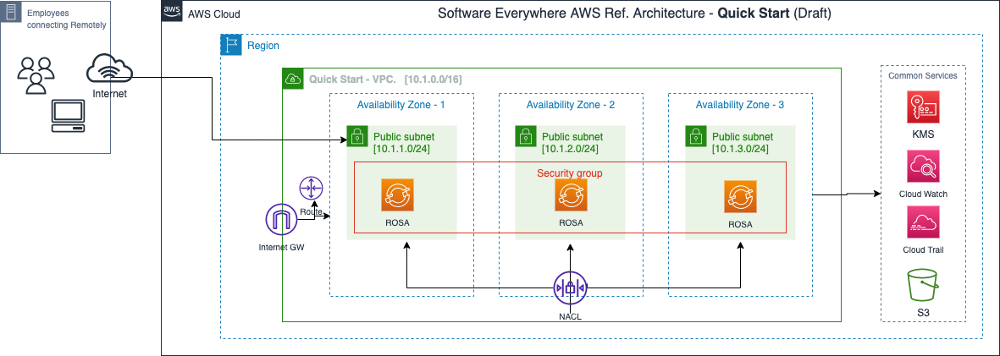
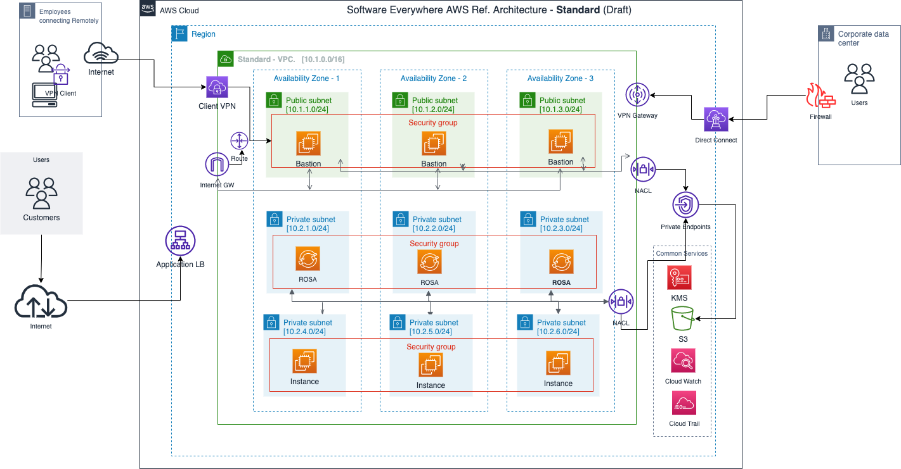
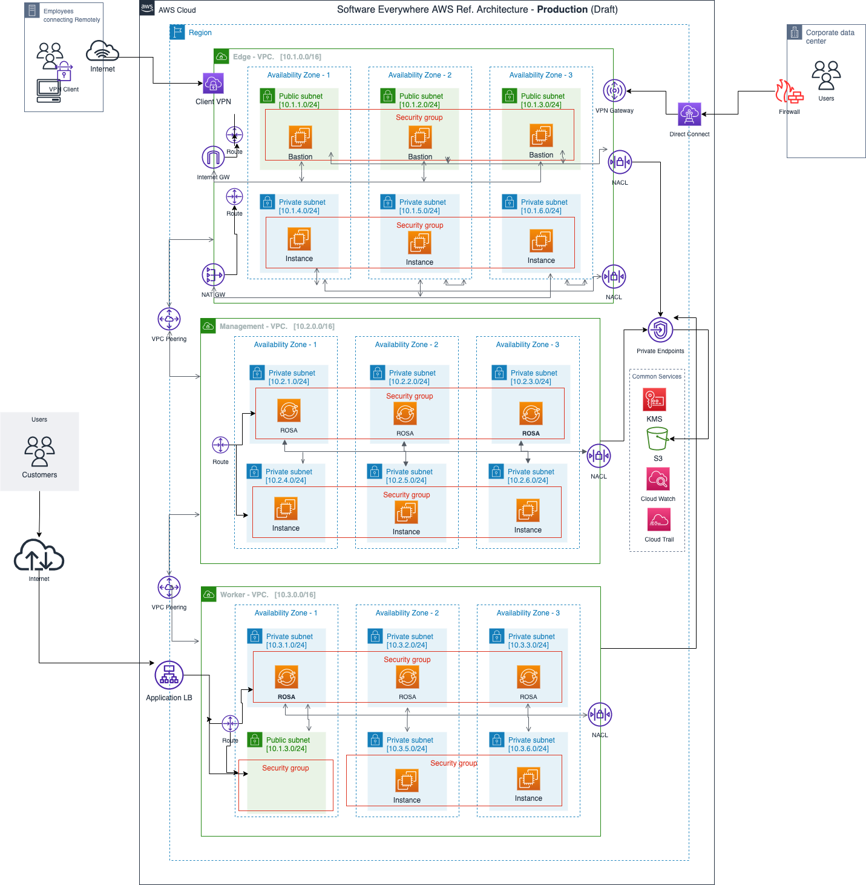

The reference architectures are provided in three different forms, with increasing security and associated complexity. The source of these reference architecture diagrams can be found here

## Quick Start

As the name suggests, Quick Start provides a simple architecture intended to get up and running quickly with OpenShift on AWS Cloud with minimum security control.

## Standard

The Standard architecture provides a secure OpenShift architecture contained within a two VPC network. It is sufficient for PoCs  and development environments.

## Production

The Production architecture provides a secure OpenShift architecture with network isolation between several VPC segments and subnets.

