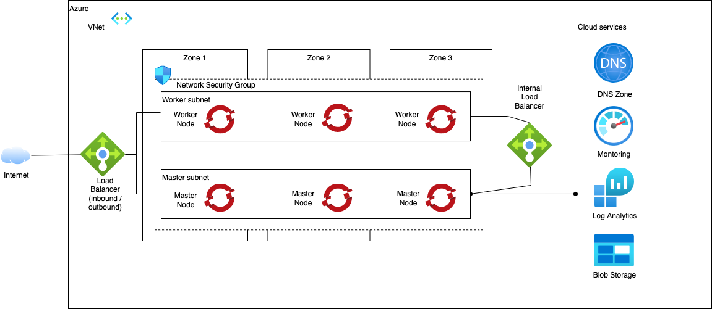

# Azure OpenShift Quick Start Reference Architectures

As the name suggests, Quick Start provides a simple architecture intended to get up and running quickly with Red Hat OpenShift Installer Provisioned Infrastructure.

