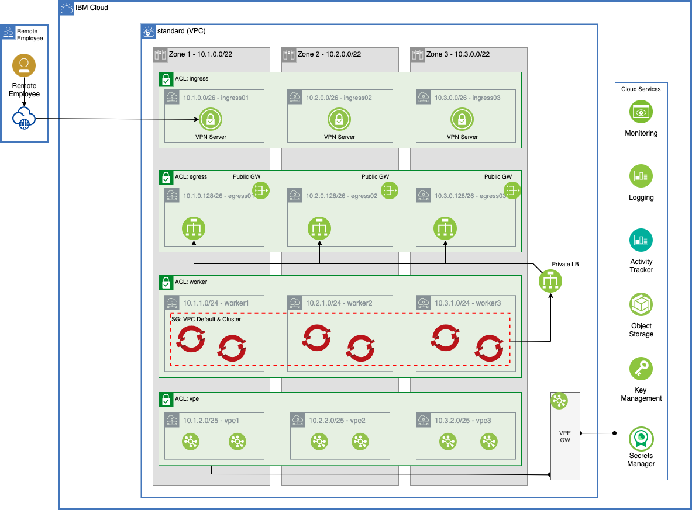

# IBM Cloud OpenShift Standard Reference Architectures

## Standard

The Standard architecture provides a secure OpenShift architecture contained within a single VPC network. It is sufficient for many production and development environments.

