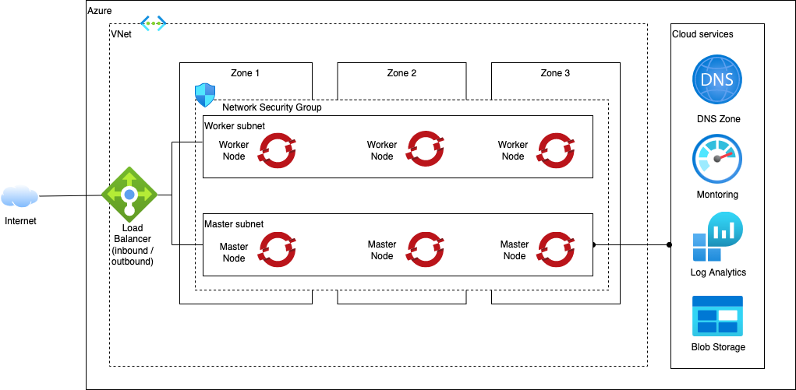

# Azure Quick Start Reference Architecture

Automation to provision the Quick Start reference architecture on Azure. This architecture implements the minimum infrastructure required to stand up a managed Red Hat OpenShift cluster with public endpoints.

## Reference Architecture



The automation is delivered in a number of layers that are applied in order. Layer `110` provisions the infrastructure including the Red Hat OpenShift cluster and the remaining layers provide configuration inside the cluster. Each layer depends on resources provided in the layer before it (e.g. `200` depends on `110`). Where two layers have the same numbers (e.g. `205`), you have a choice of which layer to apply.

<table>
<thead>
<tr>
<th>Layers</th>
<th>Quick Start</th>
<th>Standard</th>
<th>Advanced</th>
</tr>
</thead>
<tbody>
<tr>
<th>0xx - Setup</th>
<td>N/A</td>
<td><ul><li>000 - Account Setup</li></ul></td>
<td><ul><li>000 - Account Setup</li></ul></td>
</tr>
<tr>
<th>1xx - Infrastructure</th>
<td><ul><li><a href="1-quickstart/110-azure-ocp-ipi.yaml">110 - Azure OpenShift IPI</a></li></ul></td>
<td>
<ul>
<li>100 - Shared Services</li>
<li>110 - VPC OpenShift</li>
</ul>
</td>
<td>
<ul>
<li>100 - Shared Services</li>
<li>110 - Edge VPC</li>
<li>130 - Development VPC OpenShift</li>
<li>150 - Production VPC OpenShift</li>
</ul>
</td>
</tr>
<tr>
<th>2xx - OpenShift configuration</th>
<td>
<ul>
<li><a href="1-quickstart/205-portworx-storage.yaml">205 - Portworx Storage</a></li>
</ul>
</td>
<td>
<ul>
<li>205 - Portworx Storage</li>
</ul>
</td>
<td>
<ul>
<li>205 - Portworx Storage</li>
</ul>
</td>
</tr>
</tbody>
</table>

## Automation

### Prerequisites

1. Owner and User Access Administrator roles in an Azure Subscription. The user must be able to create a service principal per the below prerequisite.

2. [Configure Azure DNS](https://github.com/openshift/installer/blob/d0f7654bc4a0cf73392371962aef68cd9552b5dd/docs/user/azure/dnszone.md).
   1. In this example it will be referred as `clusters.azure.example.com`, set up in a resource group called `ocp-ipi-rg`.

3. [Create a Service Principal](https://github.com/openshift/installer/blob/d0f7654bc4a0cf73392371962aef68cd9552b5dd/docs/user/azure/credentials.md) with proper IAM roles.

3. Install [Azure CLI](https://docs.microsoft.com/en-us/cli/azure/install-azure-cli).

4. Get your [OpenShift installer pull secret](https://console.redhat.com/openshift/install/pull-secret) and save it in `./pull-secret`.

5. (Optional) Install and start Colima to run the terraform tools in a local bootstrapped container image.

    ```shell
    brew install docker colima
    colima start
    ```

### Setup

1. Clone this repository to your local SRE laptop or into a secure terminal. Open a shell into the cloned directory.
2. Copy **credentials.template** to **credentials.properties**.
    ```shell
    cp credentials.template credentials.properties
    ```
3. Provide values for the variables in **credentials.properties** (**Note:** `*.properties` has been added to **.gitignore** to ensure that the file containing the apikey cannot be checked into Git.)
    - **TF_VAR_subscription_id** - The Azure subscription id where the cluster will be deployed
    - **TF_VAR_tenant_id** - The Azure tenant id that owns the subscription
    - **TV_VAR_client_id** - The id of the service principal with Owner and User Administrator access to the subscription for cluster creation
    - **TV_VAR_client_secret** - The password of the service principal with Owner and User Administrator access to the subscription for cluster creation
    - **TV_VAR_pull_secret** - The contents of the Red Hat OpenShift pull secret downloaded in the prerequsite steps

4. Run **./launch.sh**. This will start a container image with the prompt opened in the `/terraform` directory, pointed to the repo directory.
5. Create a working copy of the terraform by running **./setup-workspace.sh**. The script makes a copy of the terraform in `/workspaces/current` and set up a "terraform.tfvars" file populated with default values. The **setup-workspace.sh** script has a number of optional arguments.

    ```
    Usage: setup-workspace.sh [-s STORAGE] [-r REGION] [-n PREFIX_NAME]
    
    where:
      - **STORAGE** - The storage provider. Possible options are `portworx` or `odf`. If not provided as an argument, a prompt will be shown.
      - **REGION** - the Azure location where the infrastructure will be provided ([available regions](https://cloud.ibm.com/docs/overview?topic=overview-locations#regions)). If not provided the value defaults to `us-east`
      - **PREFIX_NAME** - the name prefix that should be added to all the resources. If not provided a prefix will not be added.
    ```
6. Change the directory to the current workspace where the automation was configured (e.g. `/workspaces/current`).
7. Inspect **terraform.tfvars** to see if there are any variables that should be changed. (The **setup-workspace.sh** script has generated **terraform.tfvars** with default values and can be used without updates, if desired.)

    **Note:** A soft link has been created to the **terraform.tfvars** in each of the terraform subdirectories so the configuration is shared between all of them. 

#### Run all the terraform layers automatically

From the **/workspace/current** directory, run the following:

```
./apply-all.sh
```

The script will run through each of the terraform layers in sequence to provision the entire infrastructure.

#### Run all the terraform layers manually

From the **/workspace/current** directory, run change directory into each of the layer subdirectories and run the following:

```shell
terraform init
terraform apply -auto-approve
```
