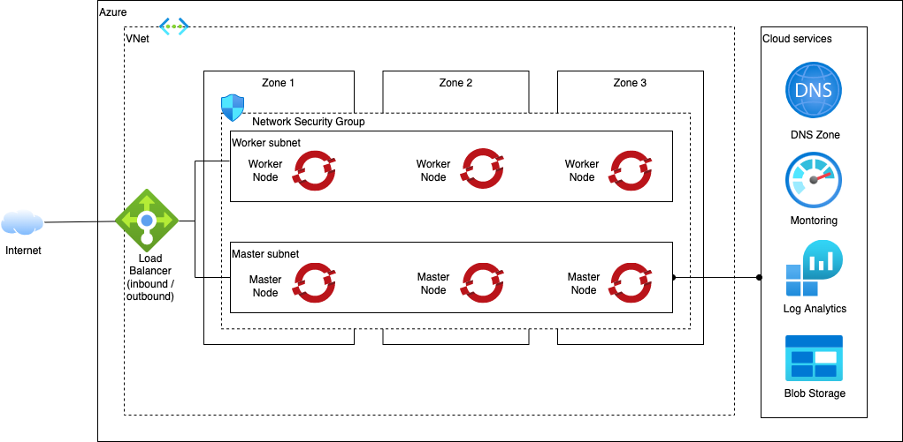

# Azure Reference Architecture - Automation

> This collection of Azure terraform automation bundles has been crafted from a set of [Terraform modules](https://modules.cloudnativetoolkit.dev/) created by the IBM Ecosystem Labs team part of the [IBM Ecosystem organization](https://www.ibm.com/partnerworld/public?mhsrc=ibmsearch_a&mhq=partnerworld). Please contact **Matthew Perrins** __mjperrin@us.ibm.com__, **Rich Ehrhardt** __rich_ehrhardt@au1.ibm.com__, **Sean Sundberg** __seansund@us.ibm.com__, or **Andrew Trice** __amtrice@us.ibm.com__ for more details or raise an issue on the [repository](https://github.com/cloud-native-toolkit/software-everywhere) for bugs or feature requests.

Three different flavors of the reference architecture are provided with different levels of complexity.

- QuickStart - minimum to get OpenShift with public endpoints running on basic VNet, subnets and load balancer. Best for non-production workloads.
- Standard - a simple robust architecture that can support a production workload in a single VNet with a VPN+Private Endpoints and an OpenShift cluster
- Advanced - a sophisticated architecture isolating DMZs, Development and Production VNets for best practices

## Reference architectures

This set of automation packages was generated using the open-source [`isacable`](https://github.com/cloud-native-toolkit/iascable) tool. This tool enables a [Bill of Material yaml](https://github.com/cloud-native-toolkit/automation-solutions/tree/main/boms) file to describe your Azure architecture, which it then generates the terraform modules into a package of infrastructure as code that you can use to accelerate the configuration of your Azure environment. Iascable generates standard terraform templates that can be executed from any terraform environment.

> The `iascable` tool is targeted for use by advanced SRE developers. It requires deep knowledge of how the modules plug together into a customized architecture. This repository is a fully tested output from that tool. This makes it ready to consume for projects.

### Quick Start



### Standard

TBD

### Advanced

TBD

## Automation

### Prerequisites

1. Have access to an Azure subscription with "Owner" and "User Access Administrator" roles. The user must be able to create a service prinicpal.

2. Configure an Azure DNS zone with a valid public domain (refer to the README [here](1-quickstart/README.md) for more information)

3. Create a service principal to be used to create the cluster (refer to the README [here](1-quickstart/README.md) for more information)

4. Obtain a Red Hat [OpenShift installer pull secret](https://console.redhat.com/openshift/install/pull-secret)

5. (Optional) Install and start Colima to run the terraform tools in a local bootstrapped container image.

    On Mac with brew:
    ```shell
    brew install docker colima
    colima start
    ```

### Planning

1. Determine which flavor of reference architecture you will provision: Quick Start, Standard, or Advanced.
2. View the README in the automation directory for detailed instructions for installation steps and required information:
    - [Quick Start](1-quickstart)
    - [Standard](2-standard)
    - [Advanced](3-advanced)

### Setup

1. Clone this repository to your local SRE laptop or into a secure terminal. Open a shell into the cloned directory.
2. Copy **credentials.template** to **credentials.properties**.
    ```shell
    cp credentials.template credentials.properties
    ```
3. Provide values for the variables in **credentials.properties** (**Note:** `*.properties` has been added to **.gitignore** to ensure that the file containing the apikey cannot be checked into Git.)
    - **TF_VAR_subscription_id** - The Azure subscription id where the cluster will be deployed
    - **TF_VAR_tenant_id** - The Azure tenant id that owns the subscription
    - **TF_VAR_client_id** - The id of the service principal with Owner and User Administrator access to the subscription for cluster creation
    - **TF_VAR_client_secret** - The password of the service principal with Owner and User Administrator access to the subscription for cluster creation
    - **TF_VAR_pull_secret** - The contents of the Red Hat OpenShift pull secret
    - **TF_VAR_acme_registration_email** - (Optional) If using an auto-generated ingress certificate, this is the email address with which to register the certificate with LetsEncrypt.
    - **TF_VAR_testing** - This value is used to determine whether testing or staging variables should be utilised. Lease as `none` for production deployments. A value other than `none` will request in a non-production deployment.
    - **TF_VAR_portworx_spec** - A base64 encoded string of the Portworx specificatin yaml file. If left blank and using Portworx, ensure you specify the path to the Portworx specification yaml file in the `terraform.tfvars` file. For a Portworx implementation, either the `portworx_spec` or the `portworx_spec_file` values must be specified. If neither if specified, Portworx will not implement correctly.
4. Run **./launch.sh**. This will start a container image with the prompt opened in the `/terraform` directory, pointed to the repo directory.
5. Create a working copy of the terraform by running **./setup-workspace.sh**. The script makes a copy of the terraform in `/workspaces/current` and set up a "terraform.tfvars" file populated with default values. The **setup-workspace.sh** script has a number of optional arguments.

    ```
    Usage: setup-workspace.sh [-s STORAGE] [-r REGION] [-n PREFIX_NAME]
    
    where:
      - **STORAGE** - The storage provider. Possible options are `portworx` or `odf`. If not provided as an argument, no storage will included
      - **REGION** - the Azure location where the infrastructure will be provided ([available regions](https://docs.microsoft.com/en-us/azure/availability-zones/az-overview)). Codes for each location can be obtained from the CLI using,
            az account list-locations -o table
        If not provided the value defaults to `eastus`
      - **PREFIX_NAME** - the name prefix that should be added to all the resources. If not provided a prefix will not be added and the cluster will be named `quickstart`.
    ```
6. Change the directory to the current workspace where the automation was configured (e.g. `/workspaces/current`).
7. Inspect **terraform.tfvars** to see if there are any variables that should be changed. (The **setup-workspace.sh** script has generated **terraform.tfvars** with default values. At a minimum, modify the ***base_domain_name*** and ***resource_group_name*** values to suit the Azure DNS zone configured in the prerequisite steps.)

    **Note:** A soft link has been created to the **terraform.tfvars** in each of the terraform subdirectories so the configuration is shared between all of them. 

#### Run all the terraform layers automatically

From the **/workspace/current** directory, run the following:

```
./apply-all.sh
```

The script will run through each of the terraform layers in sequence to provision the entire infrastructure.

#### Run all the terraform layers manually

From the **/workspace/current** directory, run change directory into each of the layer subdirectories and run the following:

```shell
terragrunt init
terragrunt apply -auto-approve
```

### Obtain login information

Once the "105-azure-ocp-ipi" BOM (and optionally the 110-azure-acme-certificate BOM) has successfully run it is possible to obtain the login information by running from the **/workspace/current** directory:
```shell
./show-login.sh
```
