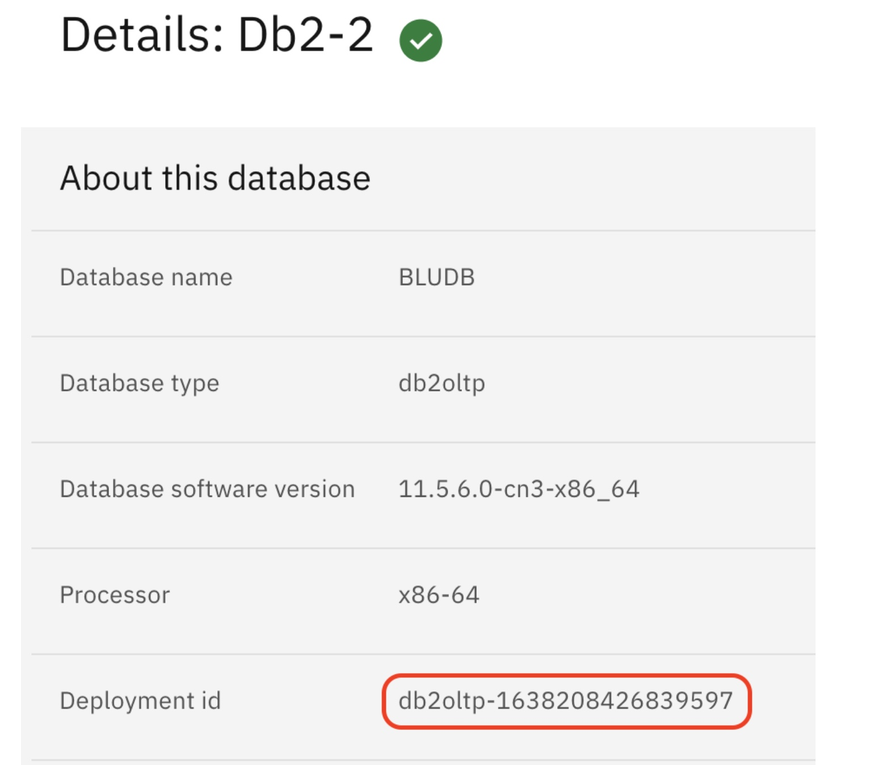
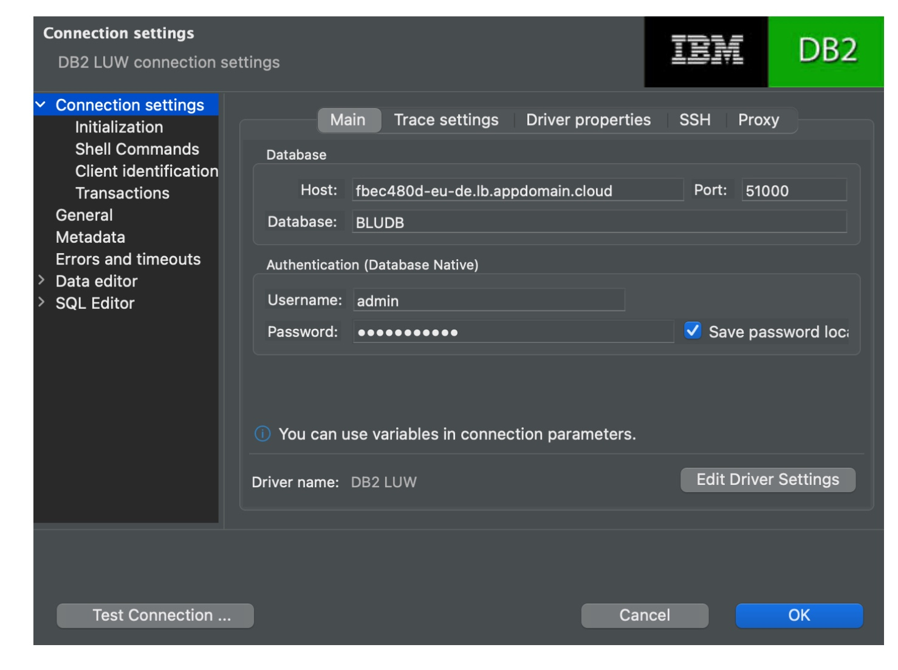
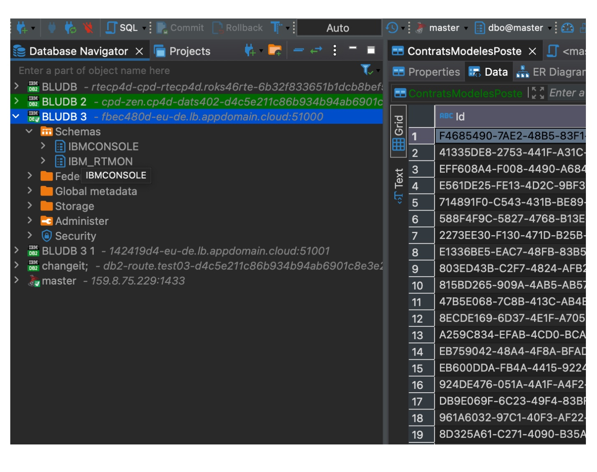
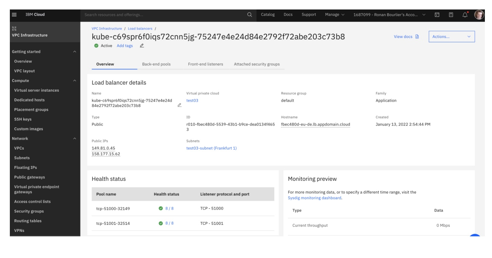

# Exposing DB2 Connection on ROKS VPC Gen2 via Load Balancer (Only IBM Cloud)

You can use this instructions to expose connections information for the DB2OLTP or DB2WH running on IBM Cloud VPC Gen2.

- A specificity from ROKS VPC Gen2 in IBM Cloud is the security level. The node servers don't have an external IP address and cannot be accessed externally.

- Once you have installed Db2 in CP4D, the usual way to vie the database externally is by using NodePort access. In our case this is not working since the node cannot be viewed externally. The solution is to use a Load Balancer that needs to be added.

*Here is the procedure* 

1. Log in to Openshift environment and go to your CP4D project.

    ```
    $ oc login -u apikey -p XXXXXXXX --server=https://c100-e.eu-de.containers.cloud.ibm.com:NNNN Login successful. You have access to 69 projects, the list has been suppressed. 
    ```
    
    You can list all projects with 'oc projects' Using project "cp4d".
    ```
    $ oc project cp4d Already on project "cp4d" on server "https://c100-e.eu-de.containers.cloud.ibm.com:NNNNN"
    ```
    

2. Find the pods for your database. In the Databases > Details page, find the Deployment id.

 

Note down the deployment id as it it will used all along the procedure. In this case **db2oltp-1638208426839597**

3. Because a VPC in IBM Cloud is oriented toward security, workers nodes are not visible from outside of its LAN. We cannot use a regular NodePort service. Let's use a LoadBalancer service in this case.

Here is the example file

    apiVersion: v1
    kind: Service
    metadata:
    name: lb-db2-2
    annotations:
        service.kubernetes.io/ibm-load-balancer-cloud-provider-ip-type: "public"
    spec:
    ports:
    - name: db
        protocol: TCP
        port: 51000
        targetPort: 50000
    - name: db-ssl
        protocol: TCP
        port: 51001
        targetPort: 50001
    type: LoadBalancer
    selector:
        app: db2oltp-1638208426839597
        component: db2oltp
        formation_id: db2oltp-1638208426839597
        role: db
        type: engine

Some explanations. - metadata.name : use the name you want.

I personaly use lb- followed by the name of my database - ports : ports name are the one you want. I keep it to db and db-ssl to know what it is. 

- I this example I create 2 ports in my load balancer forwarding to internal database port. 

- The external port 51000 forwards to the non SSL 50000 database port. the external port 51001 forwards to the SSL 50001 database port. - selector: *app* and *formation_id* point to the deployment id we noted down earlier.

4. Once your file configured and saved as *lb-db2.yaml*, let's use it.

    ```
    $ oc create -f db2-lb.yaml service/lb-db2-2 created 
    ```
    
    ```
    $ oc get svc lb-db2-2 NAME TYPE CLUSTER-IP EXTERNAL-IP PORT(S) AGE lb-db2-2 LoadBalancer 172.21.100.200 <pending> 51000:32149/TCP,51001:32514/TCP 17s
    ```
    

This command will trigger the creation of a Load Balancer in VPC.

5. Once the load balancer is created, you get all information in the command line.

    ```
    $ oc get svc lb-db2-2 NAME TYPE CLUSTER-IP EXTERNAL-IP PORT(S) AGE lb-db2-2 LoadBalancer 172.21.100.200 fbec480d-eu-de.lb.appdomain.cloud 51000:32149/TCP,51001:32514/TCP 21m
    ```
    

6. With this command you get the domain name to connect to your database. In our case *fbec480d-eu-de.lb.appdomain.cloud* and you can test it.

    ```
    $ nc -zv fbec480d-eu-de.lb.appdomain.cloud 51000 Connection to fbec480d-eu-de.lb.appdomain.cloud (158.177.15.62) 51000 port [tcp/*] succeeded!
    ```
    
    ```
    $ nc -zv fbec480d-eu-de.lb.appdomain.cloud 51001 Connection to fbec480d-eu-de.lb.appdomain.cloud (158.177.15.62) 51001 port [tcp/*] succeeded!
    ```
    
7. You have successfully configured db2 oltp with load balancer which can be accessed externally by any DB2 Client too.

## DBeaver External Connection 

Here is the example of connecting db2 oltp with the DBeaver DB2Client but you can use any db2client.

 

 

## VPC Load Balancer

If you need more details on the load balancer, you can find it in the VPC load balancer

 

---

## Summary

This concludes the instructions for exposing the DB2OLTP or DB2WH to external on IBM Cloud.


