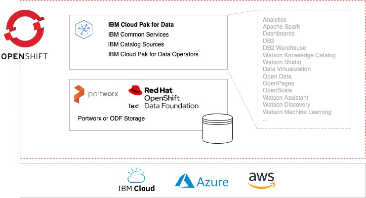
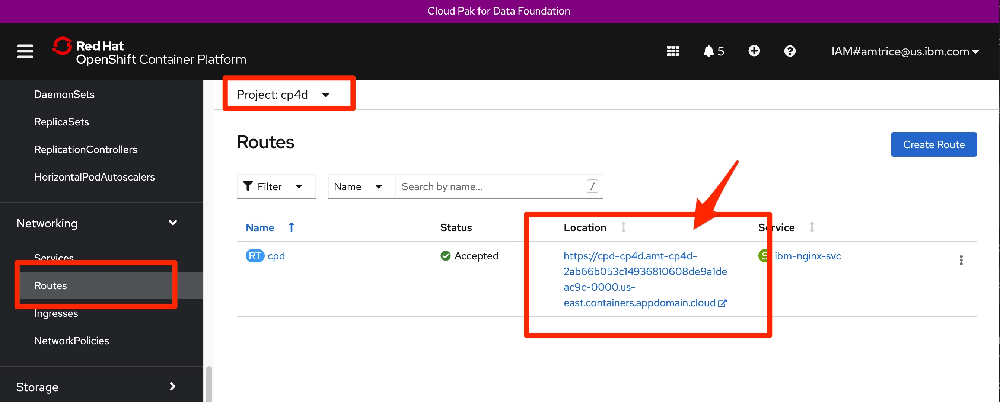

# Cloud Pak for Data Foundation with DB2OLTP Automation for AWS, Azure, and IBM Cloud

### Change Log

- **06/2022** - Initial Release

> This collection of Cloud Pak for Data terraform automation layers has been crafted from a set of  [Terraform modules](https://modules.cloudnativetoolkit.dev/) created by the IBM GSI Ecosystem Lab team part of the [IBM Partner Ecosystem organization](https://www.ibm.com/partnerworld/public?mhsrc=ibmsearch_a&mhq=partnerworld). Please contact **Matthew Perrins** _mjperrin@us.ibm.com_, **Sean Sundberg** _seansund@us.ibm.com_, **Bala Sivasubramanian** _bala_@us.ibm.com_,  or **Andrew Trice** _amtrice@us.ibm.com_ for more details or raise an issue on the repository.

The automation will support the installation of Data Foundation with DB2OLTP on three cloud platforms (AWS, Azure, and IBM Cloud).  Data Foundation is the minimum base layer of the Cloud Pak for Data that is required to install additional tools, services or cartridges, such as DB2OLTP, DB2 Warehouse, Data Virtualization, Watson Knowledge Studio, or multi-product solutions like Data Fabric. 

### Target Infrastructure

The Cloud Pak for Data Foundation with DB2OLTP automation assumes you have an OpenShift cluster already configured on your cloud of choice. The supported managed options are [ROSA for AWS](https://aws.amazon.com/rosa/), [ARO for Azure](https://azure.microsoft.com/en-us/services/openshift/) or [ROKS for IBM Cloud ](https://www.ibm.com/cloud/openshift).

Before you start to install and configure Cloud Pak for Data, you will need to identify what your target infrastructure is going to be. You can start from scratch and use one of the pre-defined reference architectures from IBM or bring your own.


### Reference Architectures


The reference architectures are provided in three different forms, with increasing security and associated sophistication to support production configuration. These three forms are as follows:


- **Quick Start** - a simple architecture to quickly get an OpenShift cluster provisioned

- **Standard** - a standard production deployment environment with typical security protections, private endpoints, VPN server, key management encryption, etc

- **Advanced** - a more advanced deployment that employs network isolation to securely route traffic between the different layers.


For each of these reference architecture, we have provided a detailed set of automation to create the environment for the software. If you do not have an OpenShift environment provisioned, please use one of these. They are optimized for the installation of this solution.  

Note:  [Cloud Pak for Data system requirements](https://www.ibm.com/docs/en/cloud-paks/cp-data/3.5.0?topic=planning-system-requirements) recommend at least 3 worker nodes, with minimum 16vCPU per node and minimum 64 GB RAM per done (128 GB RAM is recommended).

| Cloud Platform                                                                                                            | Automation and Documentation                                                                                                                                                                                  |   
|---------------------------------------------------------------------------------------------------------------------------|---------------------------------------------------------------------------------------------------------------------------------------------------------------------------------------------------------------|
| [IBM Cloud](https://cloud.ibm.com)                                                                                        | [IBM Cloud Quick Start](https://github.com/IBM/automation-ibmcloud-infra-openshift/tree/initial-version) </br> [IBM Cloud Standard](https://github.com/IBM/automation-ibmcloud-infra-openshift/tree/standard) |  
| [AWS](https://aws.amazon.com/)                                                                                            | [AWS Quick Start](https://github.com/IBM/automation-aws-infra-openshift/tree/1-quick-start) </br> [AWS Standard - Coming soon]()                                                                              |
| [Azure](https://portal.azure.com/#home)                                                                                   | [Azure Quick Start - Coming soon]()                                                                                 |                                                                                             | 
| Bring You Own Infrastructure                                                                                              | You will need to setup GitOps and Storage details on the following steps                                                                                                                                        /


### Getting Started


Within this repository you will find a set of Terraform template bundles that embody best practices for provisioning the Data Foundation in multiple cloud environments. This `README.md` describes the SRE steps required to provision the Data Foundation software.


This suite of automation can be used for a Proof of Technology environment, or used as a foundation for production workloads with a fully working end-to-end cloud-native environment. The software installs using **GitOps** best practices with [**Red Hat Open Shift GitOps**](https://docs.openshift.com/container-platform/4.8/cicd/gitops/understanding-openshift-gitops.html)


## Data Foundation  Architecture  


The following reference architecture represents the logical view of how Data Foundation works after it is installed.  Data Foundation is deployed with either Portworx or OpenShift Data Foundation storage, within an OpenShift Cluster, on the Cloud provider of your choice.





## Deploying Data Foundation with DB2OLTP


The following instructions will help you install Cloud Pak Foundation with DB2OLTP into AWS, Azure, and IBM Cloud OpenShift Kubernetes environment.


### Licenses and Entitlements

Details on Cloud Pak for Data licensing available at https://www.ibm.com/docs/en/cloud-paks/cp-data/4.0?topic=planning-licenses-entitlements

### Obtaining your IBM entitlement API key
You must have your IBM entitlement API key to access images in the IBM Entitled Registry.

After you purchase Cloud Pak for Data, an entitlement API key for the software is associated with your My IBM account. You need this key to complete the Cloud Pak for Data installation. To obtain the entitlement key, complete the following steps:
* Log in to [Container software library on My IBM](https://myibm.ibm.com/products-services/containerlibrary) with the IBM ID and password that are associated with the entitled software.
* On the **Get entitlement key** tab, select **Copy key** to copy the entitlement key to the clipboard.
* Save the API key for later in this installation.


### Data Foundation with DB2OLTP Layered Installation

The Data Foundation automation is broken into what we call layers of automation or bundles. The bundles enable SRE activities to be optimized. The automation is generic between clouds other than configuration storage options, which are platform specific. 

| BOM ID | Name                                                                                                                                                                                                                                                           | Description                                                                                                                                                | Run Time |
|--------|----------------------------------------------------------------------------------------------------------------------------------------------------------------------------------------------------------------------------------------------------------------|------------------------------------------------------------------------------------------------------------------------------------------------------------|----------|
| 200    | [200 - OpenShift Gitops](./200-openshift-gitops)                                                                                                                                                                                                               | Set up OpenShift GitOps tools in an OpenShift cluster. This is required to install the software using gitops approaches.                                   | 10 Mins  |
| 210    | [210 - IBM Portworx Storage](./210-ibm-portworx-storage) <br> [210 - IBM OpenShift Data Foundation](./210-ibm-odf-storage)  <br>  [210 - AWS Portworx Storage](./210-aws-portworx-storage)  <br>  [210 - Azure Portworx Storage](./210-azure-portworx-storage) | Use this automation to deploy a storage solution for your cluster.  <br> _⚠️Portworks on AWS and Azure are currently not released, but are coming soon.⚠️_ | 10 Mins  |
| 300    | [300 - Cloud Pak for Data Entitlement](./300-cloud-pak-for-data-entitlement)                                                                                                                                                                                   | Update the OpenShift Cluster with your entitlement key                                                                                                     | 5 Mins   |
| 305    | [300 - Cloud Pak for Data Foundation](./305-cloud-pak-for-data-foundation)                                                                                                                                                                                     | Deploy the Cloud Pak for Data Foundation components                                                                                                        | 30 Mins  |
| 310 | [310 - DB2U Operator](./310-cloud-pak-for-data-db2uoperator) | _(Optional)_ Install DB2U Operator into the cluster | 15 Mins |                                                                    
| 320 | [320 - DB2 OLTP](./320-cloud-pak-for-data-db2oltp) | _(Optional)_ Install DB2 Warehouse service into the cluster | 15 Mins |                                                                


> At this time the most reliable way of running this automation is with Terraform in your local machine either through a bootstrapped container image or with native tools installed. We provide a Container image that has all the common SRE tools installed. [CLI Tools Image,](https://quay.io/repository/ibmgaragecloud/cli-tools?tab=tags) [Source Code for CLI Tools](https://github.com/cloud-native-toolkit/image-cli-tools)


## Installation Steps


Before you start the installation please install the pre-req tools on your machine.


> We have tested this on a modern Mac laptop. We are testing on M1 machines. You will need to setup the tools natively in your M1 Mac OS and not run the `launch.sh` script.


### Pre-Req Setup


Please install the following Pre-Req tools to help you get started with the SRE tasks for installing Data Foundation into an existing OpenShift Cluster on AWS, Azure, or IBM Cloud.


Pre-requisites:

- Check you have a valid GitHub ID that can be used to create a repository in your own organization [GitHub]( https://github.com/) or GitHub Enterprise account.

- Install a code editor, we recommend [Visual Studio Code](https://code.visualstudio.com/)

- Install [Brew](https://brew.sh/)

- If allowed by your corporate policy, install [Docker Desktop](https://www.docker.com/products/docker-desktop/).  If not allowed, install [Colima](https://github.com/abiosoft/colima), a replacement for Docker Desktop 

   ```

   brew install colima

   ```


Ensure the following before continuing

- Github account exists

- A Github [token](https://docs.github.com/en/enterprise-server@3.3/authentication/keeping-your-account-and-data-secure/creating-a-personal-access-token) is available with permissions set to create and remove repositories

- You are able to login to the OpenShift cluster and obtain an OpenShift login token

- Cloud Pak entitlement key, this can be obtained from visiting the [IBM Container Library](https://myibm.ibm.com/products-services/containerlibrary) as described above.


### Installing Data Foundation


The installation process will use a standard GitOps repository that has been built using the Modules to support Data Foundation installation. The automation is consistent across three cloud environments AWS, Azure, and IBM Cloud.


Steps:


1. First step is to clone the automation code to your local machine. Run this git command in your favorite command line shell.

    ```
    git clone git@github.com:IBM/automation-data-foundation.git
    ```

2. Navigate into the `automation-data-foundation` folder using your command line.

   a.	The README.md has a comprehensive instructions on how to install this into other cloud environments than TechZone. This document focuses on getting it running in a TechZone requested environment.

3. Next you will need to set-up your credentials.properties file. This will enable a secure deployment to your cluster.

    ```
    cp credentials.template credentials.properties
    code credential.properties
    ```

    In the `credentials.properties` file you will need to populate the values for your deployment.
    
    ```
    # Add the values for the Credentials to access the IBM Cloud
    # Instructions to access this information can be found in the README.MD
    # This is a template file and the ./launch.sh script looks for a file based on this template named credentials.properties
    TF_VAR_gitops_repo_username=
    TF_VAR_gitops_repo_token=
    TF_VAR_cluster_login_token=
    TF_VAR_server_url=
    TF_VAR_entitlement_key=
    
    # Only needed if targeting IBM Cloud Deployment
    TF_VAR_ibmcloud_api_key=
    
    # Only needed if targeting AWS Deployment
    TF_VAR_access_key=
    TF_VAR_secret_key=
    
    # Only needed if targeting Azure Deployment
    TF_VAR_azure_subscription_id=
    TF_VAR_azure_client_id=
    TF_VAR_azure_client_secret=
    TF_VAR_azure_tenant_id=
    ```
   
    > ⚠️ Do not wrap any values in `credentials.properties` in quotes


4. Add your Git Hub username and your Personal Access Token to `gitops_repo_username` and `gitops_repo_token`

5. From you OpenShift console click on top right menu and select Copy login command and click on Display Token

6. Copy the API Token value into the `cluster_login_token` value

7. Copy the Server URL into the `server_url` value, only the part starting with https

8. Copy the entitlement key, this can be obtained from visiting the [IBM Container Library](https://myibm.ibm.com/products-services/containerlibrary) and place it in the `entitlement_key` variable.

9. Complete the cloud-specific credentials to be able to provision storage **only for the platform of your choice**.

    * IBM Cloud deployments require an [API Key](https://cloud.ibm.com/iam/apikeys).
    * *(Coming Soon)* AWS Deployments require an [Access Key and Secret Key](https://docs.aws.amazon.com/general/latest/gr/aws-sec-cred-types.html#access-keys-and-secret-access-keys)
    * *(Coming Soon)* Azure Deployments require a [service principal to deploy Portworx](https://github.com/cloud-native-toolkit/terraform-azure-portworx/blob/main/README.md#prerequisites).

10. If your corporate policy does not allow use of Docker Desktop, then you need to install **Colima** as an alternative

     ```
     brew install colima
     colima start
     ```


9. We are now ready to start installing Data Foundation, run the `launch.sh` command, make sure you are in the root of the `automation-data-foundation` repository

   ```
   ./launch.sh
   Cleaning up old container: cli-tools-WljCg
   Initializing container cli-tools-WljCg from quay.io/cloudnativetoolkit/cli-tools:v1.1
   Attaching to running container...
   /terraform $
   ```


10. **launch.sh** will download a container image that contains all the command line tools to enable easy installation of the software. Once it has downloaded, it will mount the local file system and exec into the container for you to start running commands from within this custom container.


> we expect partners and clients will use their own specific **Continuous Integration** tools to support this the IBM team has focused on getting it installed in the least complicated way possible


11. Next step is to create a workspace to run the Terraform automation.  Below you can see the parameters to configure your workspace for terraform execution.

    ```
    /terraform $ ./setup-workspace.sh -h
    Creates a workspace folder and populates it with automation bundles you require.
    
    Usage: setup-workspace.sh
    options:
    -p     Cloud provider (aws, azure, ibm)
    -s     Storage (portworx or odf)
    -n     (optional) prefix that should be used for all variables
    -h     Print this help
    ```

    You will need to select the cloud provider of your choice, storage option, and if desired, a prefix for naming new resource instances on the Cloud account.

    > ⚠️ At this time, only IBM Cloud is supported, but support for Azure and AWS will be released in the coming days.

12. Run the command `setup-workspace.sh -p ibm -s portworx -n df`

    ```
    /terraform $ ./setup-workspace.sh -p ibm -s portworx -n df
    Setting up workspace in '/terraform/../workspaces/current'
    *****
    Setting up workspace from '' template
    *****
    Setting up automation  /workspaces/current
    /terraform
    Setting up current/200-openshift-gitops from 200-openshift-gitops
      Skipping 210-aws-portworx-storage because it does't match ibm
      Skipping 210-azure-portworx-storage because it does't match ibm
    Setting up current/210-ibm-odf-storage from 210-ibm-odf-storage
    Setting up current/210-ibm-portworx-storage from 210-ibm-portworx-storage
    Setting up current/300-cloud-pak-for-data-entitlement from 300-cloud-pak-for-data-entitlement
    Setting up current/305-cloud-pak-for-data-foundation from 305-cloud-pak-for-data-foundation
    Setting up current/310-cloud-pak-for-data-db2wh from 310-cloud-pak-for-data-db2wh
    move to /workspaces/current this is where your automation is configured
    ```
13. The default `terraform.tfvars` file is symbolically linked to the new `workspaces/current` folder so this enables you to edit the file in your native operating system using your editor of choice.

14. Edit the default `terraform.tfvars` file this will enable you to setup the GitOps parameters.

The following you will be prompted for and some suggested values.

| Variable      | Description                                               | Suggested Value                                       |
| -----------   |-----------------------------------------------------------|-------------------------------------------------------
| gitops-repo_host | The host for the git repository.                          | github.com                                            |
| gitops-repo_type | The type of the hosted git repository (github or gitlab). | github                                                |
| gitops-repo_org | The org/group/username where the git repository exists    | github userid or org - if left blank the value will default to your username                                 |
| gitops-repo_repo | The short name of the repository to create                | cp4d-gitops                                  |

The `gitops-repo_repo`, `gitops-repo_token`, `entitlement_key`, `server_url`, and `cluster_login_token` values will be loaded automatically from the credentials.properties file that was configured in an earlier step.


15. The `cp4d-instance_storage_vendor` variable should have already been populated by the `setup-workspace.sh` script. This should have the value `portworx` or `ocs`, depending on the selected storage option. 

16. You will see that the `repo_type` and `repo_host` are set to GitHub you can change these to other Git Providers, like GitHub Enterprise or GitLab.

17. For the `repo_org` value set it to your default org name, or specific a custom org value. This is the organization where the GitOps Repository will be created in. Click on top right menu and select Your Profile to take you to your default organization.

18. Set the `repo_repo` value to a unique name that you will recognize as the place where the GitOps configuration is going to be placed before Data Foundation is installed into the cluster.

19. You can change the `gitops-cluster-config_banner_text` banner text to something useful for your client project or demo.

20. Save the `terraform.tfvars` file

21. Navigate into the `/workspaces/current` folder

    > ❗️ Do not skip this step.  You must execute from the `/worksapces/current` folder.
    
22. Navigate into the `200-openshift-gitops` folder and run the following commands

    ```
    cd 200-openshift-gitops
    terraform init
    terraform apply --auto-approve
    ```


23. This will kick off the automation for setting up the GitOps Operator into your cluster.  Once complete, you should see message similar to:

    ```
    Apply complete! Resources: 78 added, 0 changed, 0 destroyed.
    ```

24. You can check the progress by looking at two places, first look in your github repository. You will see the git repository has been created based on the name you have provided. The Cloud Pak for data foundation with DB2OLTP  install will populate this with information to let OpenShift GitOps install the software. The second place is to look at the OpenShift console, Click Workloads->Pods and you will see the GitOps operator being installed.


25. Change directories to the `210-*` folder and run the following commands to deploy storage into your cluster:

    ```
    cd 210-ibm-portworx-storage
    terraform init
    terraform apply --auto-approve
    ```
    
    > This folder will vary based on the platform and storage options that you selected in earlier steps.
26. 
    Storage configuration will run asynchronously in the background inside of the Cluster and should be complete within 10 minutes.
    
27. Change directories to the `300-cloud-pak-for-data-entitlement` folder and run the following commands to deploy entitlements into your cluster:

    ```
    cd ../300-cloud-pak-for-data-entitlement
    terraform init
    terraform apply --auto-approve
    ```
    
    > This step **does not** require worker nodes to be restarted as some other installation methods describe.

28. Change directories to the `305-cloud-pak-for-data-foundation` folder and run the following commands to deploy Data Foundation into the cluster.

    ```
    cd ../305-cloud-pak-for-data-foundation
    terraform init
    terraform apply --auto-approve
    ```

    Data Foundation deployment will run asynchronously in the background, and may require up to 45 minutes to complete.

29. You can check the progress of the deployment by opening up Argo CD (OpenShift GitOps).  From the OpenShift user interface, click on the Application menu 3x3 Icon on the header and select **Cluster Argo CD** menu item.)

    This process will take between 30 and 45 minutes to complete.  During the deployment, several cluster projects/namespaces and deployments will be created.

30. Once deployment is complete, go back into the OpenShift cluster user interface and navigate to view `Routes` for the `cp4d` namespace.  Here you can see the URL to the deployed Data Foundation instance.  Open this url in a new browser window.

    

31. Navigate to `Secrets` in the `cp4d` namespace, and find the `admin-user-details` secret.  Copy the value of `initial_admin_password` key inside of that secret. 

32. Go back to the Cloud Pak for Data Foundation instance that you opened in a separate window.  Log in using the username `admin` with the password copied in the previous step.

### Installing DB2OLTP with pre-req DB2U Operator

33. Change directories to the `310-cloud-pak-for-data-db2uoperator` folder and run the following commands to deploy entitlements into your cluster:

    ```
    cd ../310-cloud-pak-for-data-db2uoperator
    terraform init
    terraform apply --auto-approve
    ```
    
    > This step will install DB2U Operator which is Pre-Req for DB2 WH Operator.

34. Change directories to the `315-cloud-pak-for-data-db2oltp` folder and run the following commands to deploy entitlements into your cluster:

    ```
    cd ../315-cloud-pak-for-data-db2oltp
    terraform init
    terraform apply --auto-approve
    ```
    
    > This step will install DB2OLTP Operator and instance into cluster. You can login to CP4D Console (Refer Step 30) and verify the service instance. 

### Create DB2OLTP database instance via Manually (⚠️⚠️ Automation coming soon in CPD 4.5 release)
35. You can manually create the database for DB2OLTP by following the instructions https://www.ibm.com/docs/en/cloud-paks/cp-data/4.0?topic=db2-creating-database-deployment

    > This step will create the database on the cluster using CP4D Console

This will create a database using many of the default values. You can adjust through the process for any resources you wish to change to support your requirements.

Login to cpd console based on step #30
```   
- From the hamburger menu
    - Data->Databases
      - Create a database
      - Select a database type
      - Click Next

    - Configure
      - Provide a database name
      - Click Next

    - Advance Configuration
      - Page size: 16384
      - Click Next

    - System storage    
      - Storage Class : portworx-db2-rwx-sc
      - Size : 100 GB
      - Access Mode: ReadWriteMany
      - Click Next
      
    - User storage
      - Storage Class : portworx-db2-rwo-sc (RWO with 4K block size)
      - Size : 100 GB
      - Access Mode: ReadWriteOnce
      - Click Next

    - Backup storage
      - Storage Class : portworx-db2-rwx-sc
      - Size : 100 GB
      - Access Mode: ReadWriteMany
      - Click Next

    - Transaction logs storage
      - Storage Class : portworx-db2-rwo-sc (RWO with 4K block size)
      - Size : 100 GB
      - Access Mode: ReadWriteOnce
      - Click Next
      
    - Temporary table spaces storage
      - Storage Class : portworx-db2-rwo-sc (RWO with 4K block size)
      - Size : 100 GB
      - Access Mode: ReadWriteOnce
      - Click Finalize
```  

As a result, Database for DB2OLTP will be created.

### Exposing DB2OLTP Connection on ROKS VPC Gen2 via Load Balancer

Sometimes it can be helpful to setup internet access to the DB2 OLTP pod(s) running in OpenShift on IBM Cloud.  Using your favorite database client you can connect to the database and browse tables, execute queries, etc. 

1.  If you have installed DB2OLTP on IBM Cloud VPC Gen2, follow the [instructions](README-DB2-Expose-External.md)
    
    > The instructions shows how to setup an external route and connect to DB2 from a database client on your laptop.

## Summary

This concludes the instructions for installing *CP4D Data foundation with DB2OLTP* on AWS, Azure, and IBM Cloud.

Now that the Data Foundation deployment is complete you can deploy [Cloud Pak for Data services](https://www.ibm.com/docs/en/cloud-paks/cp-data/4.0?topic=integrations-services) into this cluster.


## Uninstalling & Troubleshooting

Please refer to the [Troubleshooting Guide](./TROUBLESHOOTING.md) for uninstallation instructions and instructions to correct common issues.

If you continue to experience issues with this automation, please [file an issue](https://github.com/IBM/automation-data-foundation/issues) or reach out on our [public Dischord server](https://discord.com/channels/955514069815808010/955514069815808013).


## How to Generate this repository from teh source Bill of Materials.


This set of automation packages was generated using the open-source [`isacable`](https://github.com/cloud-native-toolkit/iascable) tool. This tool enables a [Bill of Material yaml](https://github.com/cloud-native-toolkit/automation-solutions/tree/main/boms/software/cp4d) file to describe your software requirements. If you want up stream releases or versions you can use `iascable` to generate a new terraform module.


> The `iascable` tool is targeted for use by advanced SRE developers. It requires deep knowledge of how the modules plug together into a customized architecture. This repository is a fully tested output from that tool. This makes it ready to consume for projects.
