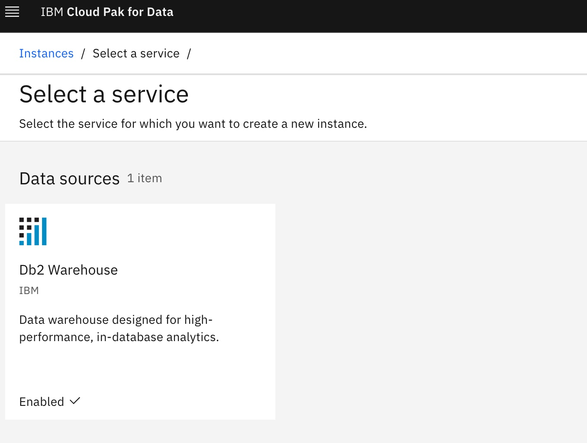

# DB2WH Automation  for AWS, Azure, and IBM Cloud

### Change Log

- **06/2022** - Initial Release


The automation will support the installation DB2WH on three cloud platforms (AWS, Azure, and IBM Cloud).   

### Data Fabric Layered Installation

The Data Foundation automation is broken into what we call layers of automation or bundles. The bundles enable SRE activities to be optimized. The automation is generic between clouds other than configuration storage options, which are platform specific. 

| BOM ID | Name                                                                                                                                                                                                                                                           | Description                                                                                                                                                | Run Time |
|--------|----------------------------------------------------------------------------------------------------------------------------------------------------------------------------------------------------------------------------------------------------------------|------------------------------------------------------------------------------------------------------------------------------------------------------------|----------|
| 300    | [300 - Cloud Pak for Data Entitlement](./300-cloud-pak-for-data-entitlement)                                                                                                                                                                                   | Update the OpenShift Cluster with your entitlement key                                                                                                     | 5 Mins   |
| 305    | [300 - Cloud Pak for Data Foundation](./305-cloud-pak-for-data-foundation)                                                                                                                                                                                     | Deploy the Cloud Pak for Data Foundation components                                                                                                        | 30 Mins  |
| 310 | [310 - DB2U Operator](./310-cloud-pak-for-data-db2uoperator) | Install DB2U Operator into the cluster | 10 Mins |                                                                    
| 315 | [315 - DB2 Warehouse](./315-cloud-pak-for-data-db2wh) | Install DB2 Warehouse service into the cluster | 15 Mins |    


> At this time the most reliable way of running this automation is with Terraform in your local machine either through a bootstrapped container image or with native tools installed. We provide a Container image that has all the common SRE tools installed. [CLI Tools Image,](https://quay.io/repository/ibmgaragecloud/cli-tools?tab=tags) [Source Code for CLI Tools](https://github.com/cloud-native-toolkit/image-cli-tools)


### Pre-Req Setup


⚠️⚠️ Please install the [Cloud Pak for Data data foundation](README.md) before you proceed with DB2WH installation and make sure its success.
    
### Installing DB2WH with pre-req DB2U Operator

1. Change directories to the `310-cloud-pak-for-data-db2uoperator` folder and run the following commands to deploy entitlements into your cluster:

    ```
    cd ../310-cloud-pak-for-data-db2uoperator
    terraform init
    terraform apply --auto-approve
    ```
    
    > This step will install DB2U Operator which is Pre-Req for DB2 WH Operator.

2. Change directories to the `315-cloud-pak-for-data-db2wh` folder and run the following commands to deploy entitlements into your cluster:

    ```
    cd ../315-cloud-pak-for-data-db2wh
    terraform init
    terraform apply --auto-approve
    ```
    
    > This step will install DB2WH Operator and service into cluster. You can login to CP4D Console (Refer Step 30) and verify the service instance. 
  
  

### Create DB2WH database instance via Manually (⚠️⚠️ Automation coming soon in CPD 4.5 release)

3. You can manually create the database for DB2WH by following the instructions https://www.ibm.com/docs/en/cloud-paks/cp-data/4.0?topic=warehouse-creating-database-deployment

    > This step will create the database on the cluster using CP4D Console

Login to cpd console based on Step #30

  ```
- From the hamburger menu
  - Data->Databases
    - Create a database
    - Select a database type
    - Click Next

  - Configure
    - Provide a database name 
    - Number of nodes
    - CPU per node
    - Memory per node
    - Click Next

  - Advance Configuratin
    - Multiple logic nodes
    - Workload : Analytics
    - Click Next

  - System storage    
    - Storage Template : portworx-db2-rwx-sc
    - Size : 100 GB
    - Click Next

  - User storage
    - Storage Template : portworx-db2-rwx-sc (RWO with 4K block size)
    - Size :100 GB
    - Access Mode : ReadWriteOnce
    - Click Next

  - Backup storage
    - Create new Storage 
    - Use storage template
    - Storage Class : portworx-db2-rwx-sc
    - Size : 100 GB
    - Click Next

  - Transaction logs storage
    - Use storage template
    - Storage Class : portworx-db2-rwx-sc (RWO with 4K block size)
    - Size : 100 GB
   - Click Next

  - Temporary table spaces storage
    - Use storage template
    - Storage Class : portworx-db2-rwx-sc (RWO with 4K block size)
    - Size : 100 GB
    - Click Finalize
  ```

As a result, Database for DB2WH will be created.

### Exposing DB2WH Connection on ROKS VPC Gen2 via Load Balancer

Sometimes it can be helpful to setup internet access to the DB2 Warehouse pod(s) running in OpenShift on IBM Cloud.  Using your favorite database client you can connect to the database and browse tables, execute queries, etc.  

1. If you have installed DB2WH on IBM Cloud VPC Gen2, follow the  [instructions](README-DB2-Expose-External.md)
    
      > The instructions shows how to setup an external route and connect to DB2 from a database client on your laptop.

## Summary

This concludes the instructions for installing *DB2WH* on AWS, Azure, and IBM Cloud.

## Uninstalling & Troubleshooting

Please refer to the [Troubleshooting Guide](./TROUBLESHOOTING.md) for uninstallation instructions and instructions to correct common issues.

If you continue to experience issues with this automation, please [file an issue](https://github.com/IBM/automation-data-foundation/issues) or reach out on our [public Dischord server](https://discord.com/channels/955514069815808010/955514069815808013).

