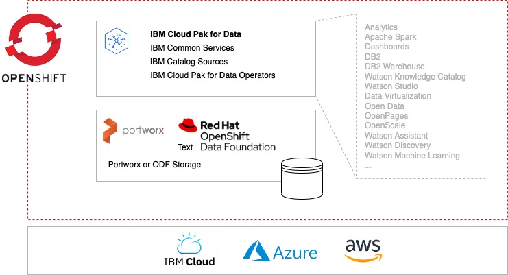
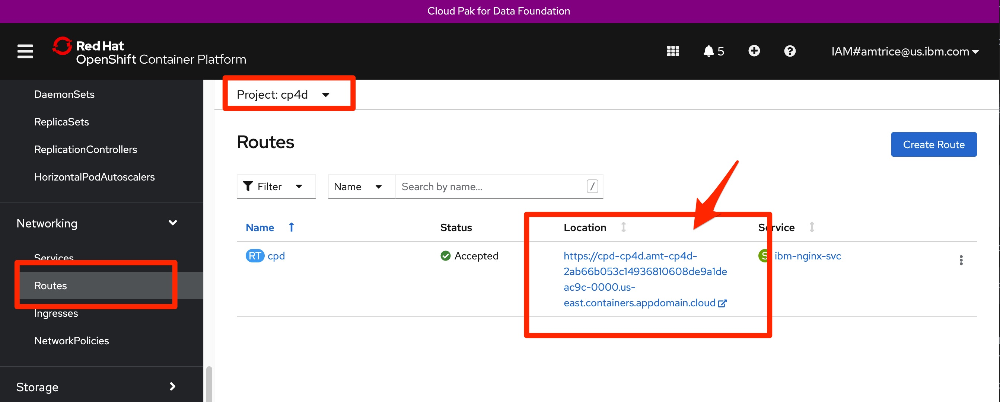

# Data Foundation 4.0.x Automation for AWS, Azure, and IBM Cloud, creating with the TechZone Accelerator Toolkit

### Change Log

- **01/2023** - Updated for CP4D 4.6, using Cloud Pak Deployer
- **11/2022** - Updated for Terragrunt & GitOps provider support
- **08/2022** - Added CPD 4.0.x version, fixed broken links
- **06/2022** - Fixed typos like GitClone script, replace maximo with CP4D from README
- **06/2022** - Support for CP4D Data source services DB2OLTP and DB2Warehouse (removed)
- **06/2022** - Support for Azure
- **05/2022** - Initial Release

> This collection of Cloud Pak for Data terraform automation layers has been crafted from a set of  [Terraform modules](https://modules.cloudnativetoolkit.dev/) created by the IBM GSI Ecosystem Lab team part of the [IBM Partner Ecosystem organization](https://www.ibm.com/partnerworld/public?mhsrc=ibmsearch_a&mhq=partnerworld). Please contact **Matthew Perrins** _mjperrin@us.ibm.com_, **Sean Sundberg** _seansund@us.ibm.com_, **Tom Skill** _tskill@us.ibm.com_,  or **Andrew Trice** _amtrice@us.ibm.com_ or **Bala Sivasubramanian** _bala@us.ibm.com_ for more details or raise an issue on the repository.

The automation will support the installation of Cloud Pak For Data on three cloud platforms (AWS, Azure, and IBM Cloud) by leveraging the [Cloud Pak Deployer](https://ibm.github.io/cloud-pak-deployer/introduction/) in-cluster in a GitOps configuration.  Data Foundation is the minimum base layer of the Cloud Pak for Data that is required to install additional tools, services or cartridges, such as DB2 Warehouse, Data Virtualization, Watson Knowledge Studio, or multi-product solutions like Data Fabric.  Additional cartridges can be installed by changing installation options in the `cp4d.tfvars` file, as described later in this document.

### Target Infrastructure

The Cloud Pak for Data - Foundation automation assumes you have an OpenShift cluster already configured on your cloud of choice. The supported managed options are [ROSA for AWS](https://aws.amazon.com/rosa/), [ARO for Azure](https://azure.microsoft.com/en-us/services/openshift/) or [ROKS for IBM Cloud ](https://www.ibm.com/cloud/openshift).

Before you start to install and configure Cloud Pak for Data, you will need to identify what your target infrastructure is going to be. You can start from scratch and use one of the pre-defined reference architectures from IBM or bring your own.

> ⚠️ Cloud Pak for Data 4.6 requires an OpenShift 4.10 cluster.

### Reference Architectures


The reference architectures are provided in three different forms, with increasing security and associated sophistication to support production configuration. These three forms are as follows:


- **Quick Start** - a simple architecture to quickly get an OpenShift cluster provisioned

- **Standard** - a standard production deployment environment with typical security protections, private endpoints, VPN server, key management encryption, etc

- **Advanced** - a more advanced deployment that employs network isolation to securely route traffic between the different layers.


For each of these reference architecture, we have provided a detailed set of automation to create the environment for the software. If you do not have an OpenShift environment provisioned, please use one of these. They are optimized for the installation of this solution.

Note:  [Cloud Pak for Data 4.0 system requirements](https://www.ibm.com/docs/en/cloud-paks/cp-data/4.0?topic=planning-system-requirements) recommend at least 3 worker nodes, with minimum 16vCPU per node and minimum 64 GB RAM per done (128 GB RAM is recommended).

| Cloud Platform                          | Automation and Documentation                                                                                                                                                                                                                                              |   
|-----------------------------------------|---------------------------------------------------------------------------------------------------------------------------------------------------------------------------------------------------------------------------------------------------------------------------|
| [IBM Cloud](https://cloud.ibm.com)      | [IBM Cloud Quick Start](https://github.com/IBM/automation-ibmcloud-infra-openshift) <br /> [IBM Cloud Standard - Coming soon](https://github.com/IBM/automation-ibmcloud-infra-openshift) <br /> [IBM Cloud Advanced - Coming soon](https://github.com/IBM/automation-ibmcloud-infra-openshift) |  
| [AWS](https://aws.amazon.com/)          | [AWS Quick Start - Coming soon](https://github.com/IBM/automation-aws-infra-openshift) <br /> [AWS Standard - Coming soon](https://github.com/IBM/automation-aws-infra-openshift) <br /> [AWS Advanced - Coming soon](https://github.com/IBM/automation-aws-infra-openshift) |
| [Azure](https://portal.azure.com/#home) | [Azure Quick Start](https://github.com/IBM/automation-azure-infra-openshift) <br /> [Azure Standard - Coming soon](https://github.com/IBM/automation-azure-infra-openshift) <br /> [Azure Advanced - Coming soon](https://github.com/IBM/automation-azure-infra-openshift) |                                                                                             | 
| Bring Your Own Infrastructure           | You will need a cluster with at least 16 CPUs and 64 GB of memory per node and at least 3 nodes to support storage and IBM Cloud Paks.                                                                                                                                    |                                                                               


### Getting Started


Within this repository you will find a set of Terraform template bundles that embody best practices for provisioning the Data Foundation in multiple cloud environments. This `README.md` describes the SRE steps required to provision the Data Foundation software.


This suite of automation can be used for a Proof of Technology environment, or used as a foundation for production workloads with a fully working end-to-end cloud-native environment. The software installs using **GitOps** best practices with [**Red Hat Open Shift GitOps**](https://docs.openshift.com/container-platform/4.8/cicd/gitops/understanding-openshift-gitops.html)


## Data Foundation  Architecture


The following reference architecture represents the logical view of how Data Foundation works after it is installed.  If targeting IBM Cloud, Data Foundation is deployed with OpenShift Data Foundation storage, within an OpenShift Cluster.  If targeting Amazon or AWS, the OpenShift cluster must already have OpenShift Data Foundation configured prior to using this automation.





## Deploying Data Foundation


The following instructions will help you install Cloud Pak for Data (CP4D) into AWS, Azure, and IBM Cloud OpenShift Kubernetes environment.


### Licenses and Entitlements

Details on Cloud Pak for Data licensing available at https://www.ibm.com/docs/en/cloud-paks/cp-data/4.0?topic=planning-licenses-entitlements

### Obtaining your IBM entitlement API key
You must have your IBM entitlement API key to access images in the IBM Entitled Registry.

After you purchase Cloud Pak for Data, an entitlement API key for the software is associated with your My IBM account. You need this key to complete the Cloud Pak for Data installation. To obtain the entitlement key, complete the following steps:
* Log in to [Container software library on My IBM](https://myibm.ibm.com/products-services/containerlibrary) with the IBM ID and password that are associated with the entitled software.
* On the **Get entitlement key** tab, select **Copy key** to copy the entitlement key to the clipboard.
* Save the API key for later in this installation.


### Data Foundation Layered Installation

The Data Foundation automation is broken into what we call layers of automation or bundles. The bundles enable SRE activities to be optimized. The automation is generic between clouds other than configuration storage options, which are platform specific.

| BOM ID | Name                                                                                                                                                                                                                                                           | Description                                                                                                                                                | Run Time |
|--------|----------------------------------------------------------------------------------------------------------------------------------------------------------------------------------------------------------------------------------------------------------------|------------------------------------------------------------------------------------------------------------------------------------------------------------|----------|
| 200    | [200 - OpenShift Gitops](./200-openshift-gitops)                                                                                                                                                                                                               | Set up OpenShift GitOps tools in an OpenShift cluster. This is required to install the software using gitops approaches.                                   | 10 Mins  |
| 210    | [210 - IBM Portworx Storage](./210-ibm-portworx-storage) <br> [210 - IBM OpenShift Data Foundation](./210-ibm-odf-storage)  <br>  [210 - AWS Portworx Storage](./210-aws-portworx-storage)  <br>  [210 - Azure Portworx Storage](./210-azure-portworx-storage) | Use this automation to deploy a storage solution for your cluster.  | 10 Mins  |
| 300    | [300 - Cloud Pak for Data Foundation](./305-cloud-pak-for-data-foundation)                                                                                                                                                                                     | Deploy the Cloud Pak for Data Foundation components                                                                                                        | 30 Mins  |


> At this time the most reliable way of running this automation is with Terraform in your local machine either through a bootstrapped container image or with native tools installed. We provide a Container image that has all the common SRE tools installed. [CLI Tools Image,](https://quay.io/repository/ibmgaragecloud/cli-tools?tab=tags) [Source Code for CLI Tools](https://github.com/cloud-native-toolkit/image-cli-tools)


## Installation Steps


Before you start the installation please install the pre-req tools on your machine.


> We have tested this on a modern Mac laptop. We are testing on M1 machines. You will need to setup the tools natively in your M1 Mac OS and not run the `launch.sh` script.


### Pre-Req Setup


Please install the following Pre-Req tools to help you get started with the SRE tasks for installing Data Foundation into an existing OpenShift Cluster on AWS, Azure, or IBM Cloud.


Pre-requisites:

- Check you have a valid GitHub ID that can be used to create a repository in your own organization [GitHub]( https://github.com/) or GitHub Enterprise account.

- Install a code editor, we recommend [Visual Studio Code](https://code.visualstudio.com/)

- Install [Brew](https://brew.sh/)

Ensure you have the following before continuing:

- Github account exists

- A Github [token](https://docs.github.com/en/enterprise-server@3.3/authentication/keeping-your-account-and-data-secure/creating-a-personal-access-token) is available with permissions set to create and remove repositories

- You are able to login to the OpenShift cluster and obtain an OpenShift login token

- Cloud Pak entitlement key, this can be obtained from visiting the [IBM Container Library](https://myibm.ibm.com/products-services/containerlibrary) as described above.

- If you are deploying on [IBM Cloud Satellite](https://www.ibm.com/cloud/satellite), please review the [Satellite prerequisites](./IBM_SATELLITE.md).

- OpenShift Data Foundation - If targeting AWS or Azure clusters, you must configure OpenShift Data Foundation prior to running this automation.

### Installing Data Foundation


The installation process will use a standard GitOps repository that has been built using the Modules to support Data Foundation installation. The automation is consistent across three cloud environments AWS, Azure, and IBM Cloud.


#### Set up the runtime environment

At this time the most reliable way of running this automation is with Terraform in your local machine either through a bootstrapped docker image or Virtual Machine. We provide both a [container image](https://github.com/cloud-native-toolkit/image-cli-tools) and a virtual machine [cloud-init](https://github.com/cloud-native-toolkit/sre-utilities/blob/main/cloud-init/cli-tools.yaml) script that have all the common SRE tools installed.

We recommend using Docker Desktop if choosing the container image method, and Multipass if choosing the virtual machine method.   Detailed instructions for downloading and configuring both Docker Desktop and Multipass can be found in [RUNTIMES.md](./RUNTIMES.md)
    

#### Set up environment credentials


1. First step is to clone the automation code to your local machine. Run this git command in your favorite command line shell.

    ```
    git clone https://github.com/IBM/automation-data-foundation.git
    ```

2. Navigate into the `automation-data-foundation` folder using your command line.

   a.	The README.md has a comprehensive instructions on how to install this into other cloud environments than TechZone. This document focuses on getting it running in a TechZone requested environment.

3. Next you will need to set-up your credentials.properties file. This will enable a secure deployment to your cluster.

    ```shell
    cp credentials.template credentials.properties
    code credential.properties
    ```

   In the `credentials.properties` file you will need to populate the values for your deployment.

    ```text
    ## Add the values for the Credentials to access the OpenShift Environment
    ## Instructions to access this information can be found in the README.MD
    ## This is a template file and the ./launch.sh script looks for a file based on this template named credentials.properties

    ## gitops_repo_host: The host for the git repository
    #export TF_VAR_gitops_repo_host=github.com
    ## gitops_repo_username: The username of the user with access to the repository
    #export TF_VAR_gitops_repo_username=
    ## gitops_repo_token: The personal access token used to access the repository
    #export TF_VAR_gitops_repo_token=

    ## TF_VAR_server_url: The url for the OpenShift api server
    export TF_VAR_server_url=
    ## TF_VAR_cluster_login_token: Token used for authentication to the api server
    export TF_VAR_cluster_login_token=


    ## TF_VAR_entitlement_key: The entitlement key used to access the IBM software images in the container registry. Visit https://myibm.ibm.com/products-services/containerlibrary to get the key
    export TF_VAR_entitlement_key=


    # Only needed if targeting IBM Cloud Deployment
    export TF_VAR_ibmcloud_api_key=
    ```


4. If you would like to use GitHub for your GitOps repo, then you will need to populate these values. Add your GitHub username and your Personal Access Token to `TF_VAR_gitops_repo_username` and `TF_VAR_gitops_repo_token`.  If these values are left blank, the automation will deploy Gitea into the OpenShift cluster for the GitOps deployment, requiring no additional user interaction.

5. From you OpenShift console click on top right menu and select Copy login command and click on Display Token

6. Copy the API Token value into the `cluster_login_token` value

7. Copy the Server URL into the `server_url` value, only the part starting with https

8. Copy the entitlement key, this can be obtained from visiting the [IBM Container Library](https://myibm.ibm.com/products-services/containerlibrary) and place it in the `entitlement_key` variable.

9. If targeting IBM Cloud, be sure to specify an API key in the `ibmcloud_api_key` variable, to be used to automatically configure ODF storage.  If targeting AWS or Azure, be sure to configure ODF prior to using this automation.


##### Set up the automation workspace


7. Launch the automation runtime.
    - If using *Docker Desktop*, run `./launch.sh`. This will start a container image with the prompt opened in the `/terraform` directory.
    - If using *Multipass*, run `mutlipass shell cli-tools` to start the interactive shell, and cd into the `/automation/{template}` directory, where  `{template}` is the folder you've cloned this repo. Be sure to run `source credentials.properties` once in the shell.

8. Next we need to create a workspace to run the Terraform automation.  Below you can see the parameters to configure your workspace for terraform execution.

   ```
   /terraform $ ./setup-workspace.sh -h
   Creates a workspace folder and populates it with automation bundles you require.

   Usage: setup-workspace.sh
   options:
   -p     Cloud provider (aws, azure, ibm)
   -n     (optional) prefix that should be used for all variables
   -c     (optional) Self-signed Certificate Authority issuer CRT file
   -b     (optional) the banner text that should be shown at the top of the cluster
   -g     (optional) the git host that will be used for the gitops repo. If left blank gitea will be used by default. (Github, Github Enterprise, Gitlab, Bitbucket, zure DevOps, and Gitea servers are supported)
   -h     Print this help
   ```

   You will need to select the cloud provider of your choice, storage option, and if desired, a prefix for naming new resource instances on the Cloud account.

9. Run the command `setup-workspace.sh -p ibm -n df` and include optional parameters as needed.

    ```
    /terraform $ ./setup-workspace.sh -p ibm
    Setting up workspace in '/terraform/../workspaces/current'
    *****
    Setting up workspace in /workspaces/current
    *****
    Setting up current/105-existing-openshift from 105-existing-openshift
    Setting up current/200-openshift-gitops from 200-openshift-gitops
    Setting up current/210-ibm-odf-storage from 210-ibm-odf-storage
    Setting up current/300-cloud-pak-for-data-foundation from 300-cloud-pak-for-data-foundation
    move to /workspaces/current this is where your automation is configured
    ```

    > ⚠️ If you are deploying on IBM Cloud Satellite, be sure the cluster has ODF storage option configured.
   
10. The default `cluster.tfvars`, `cp4d.tfvars`, and `gitops.tfvars` files are symbolically linked to the new `workspaces/current` folder so this enables you to edit the file in your native operating system using your editor of choice.

11. Edit the default `cp4d.tfvars` file this will enable you to configure the Cloud Pak for Data deployment.  **You MUST specify a value for the `cluster_ingress`**.

12. Edit the default `gitops.tfvars` file this will enable you to setup the GitOps parameters, or leave the default configuration to use Gitea in-cluster for the GitOps repository.

The following you will be prompted for and some suggested values.

| Variable      | Description                                               | Suggested Value                                       |
| -----------   |-----------------------------------------------------------|-------------------------------------------------------
| gitops-repo_host | The host for the git repository.                          | github.com                                            |
| gitops-repo_type | The type of the hosted git repository (github or gitlab). | github                                                |
| gitops-repo_org | The org/group/username where the git repository exists    | github userid or org - if left blank the value will default to your username                                 |
| gitops-repo_repo | The short name of the repository to create                | cp4d-gitops                                  |

The `gitops-repo_repo`, `gitops-repo_token`, `entitlement_key`, `server_url`, and `cluster_login_token` values will be loaded automatically from the credentials.properties file that was configured in an earlier step.

16. You will see that the `repo_type` and `repo_host` are set to GitHub you can change these to other Git Providers, like GitHub Enterprise or GitLab.

17. For the `repo_org` value set it to your default org name, or specific a custom org value. This is the organization where the GitOps Repository will be created in. Click on top right menu and select Your Profile to take you to your default organization.

18. Set the `repo_repo` value to a unique name that you will recognize as the place where the GitOps configuration is going to be placed before Data Foundation is installed into the cluster.

19. You can change the `gitops-cluster-config_banner_text` banner text to something useful for your client project or demo.

20. Save the all changes to the `tfvars` files.

21. Navigate into the `/workspaces/current` folder

    > ❗️ Do not skip this step.  You must execute from the `/workspaces/current` folder.

    > ⚠️ If you are deploying on IBM Cloud Satellite, you must delete the `/workspaces/current/210-ibm-odf-storage` folder ODF will already have been deployed into the Satellite cluster.  For additional detail, please see the [Satellite prerequisites](./IBM_SATELLITE.md).

    > ⚠️ If your cluster already has ODF configured, you must delete the `/workspaces/current/210-ibm-odf-storage` folder.

##### Automated Deployment

22. To perform the deployment automatically, execute the `./apply-all.sh` script in the `/workspaces/current` directory.  This will apply each of the Data Foundation layers sequentially.  This operation will complete in 10-15 minutes, and the Data Foundation will continue asynchronously in the background.  This can take an additional 60 minutes.

    Alternatively you can run each of the layers individually, by following the [manual deployment instructions](MANUAL-DEPLOY.md).

    Once complete, skip to the **Access the Data Foundation Deployment** section


##### Access the Data Foundation Deployment

23. Once deployment is complete, go back into the OpenShift cluster user interface and navigate to view `Routes` for the `cpd-instance` namespace.  Here you can see the URL to the deployed Cloud Pak for Data  instance.  Open this url in a new browser window.

    

24. Navigate to `Secrets` in the `cpd-instance` namespace, and find the `admin-user-details` secret.  Copy the value of `initial_admin_password` key inside of that secret.

25. Go back to the Cloud Pak for Data Foundation instance that you opened in a separate window.  Log in using the username `admin` with the password copied in the previous step.


##### Update the deployment using GitOps

You can change the installed cartridges on the deployed Cloud Pak for Data instance by modifying the gitops configuration. This will automatically trigger a new job on the cluster that executes the Cloud Pak Deployer and applies the desired changes.

In the GitOps repo, find the `values.yaml` file located at `cp4d--gitops/payload/1-infrastructure/namespace/cloud-pak-deployer/cp4d-deployer/values.yaml`.  You can change the boolean values from `false` to `true` to install the additional cartridges.  Once you commit changes to this file, OpenShift GitOps will automatically detect the change and trigger the job which will apply the updates to the existing Cloud Pak for Data instance.  

Applying these changes is an asynchronous process that can take a few minutes, or more than an hour, depending on the changes that are being applied.  You can monitor the deployment status using the OpenShift GitOps (ArgoCD) user interface, which is accessible through the OpenShift cluster's Application Launcher menu.

## Summary

This concludes the instructions for installing *Data Foundation* on AWS, Azure, and IBM Cloud.


## Uninstalling & Troubleshooting

Please refer to the [Troubleshooting Guide](./TROUBLESHOOTING.md) for uninstallation instructions and instructions to correct common issues.

If you continue to experience issues with this automation, please [file an issue](https://github.com/IBM/automation-data-foundation/issues) or reach out on our [public Dischord server](https://discord.com/channels/955514069815808010/955514069815808013).


## How to Generate this repository from the source Bill of Materials.


This set of automation packages was generated using the open-source [`isacable`](https://github.com/cloud-native-toolkit/iascable) tool. This tool enables a [Bill of Material yaml](https://github.com/cloud-native-toolkit/automation-solutions/tree/main/boms/software/cp4d) file to describe your software requirements. If you want up stream releases or versions you can use `iascable` to generate a new terraform module.


> The `iascable` tool is targeted for use by advanced SRE developers. It requires deep knowledge of how the modules plug together into a customized architecture. This repository is a fully tested output from that tool. This makes it ready to consume for projects.
