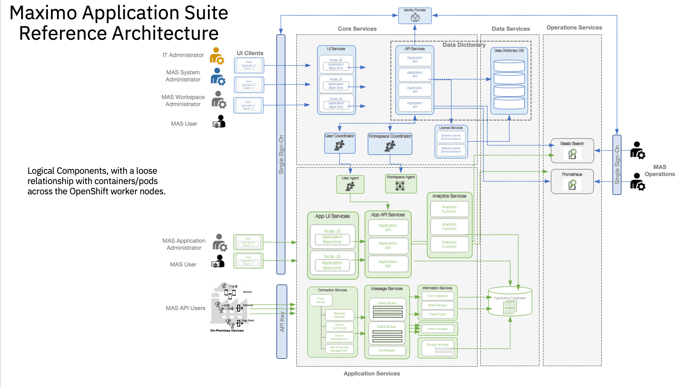

# Maximo Application Suite (MAS) - Bill of Materials

This folder contains the Bill of Materials (*BOMs*) for the Maximo Application Suite Core Automation for AWS, Azure and IBM Cloud multi cloud deployments.

Below you can see a reference architecture for  Maximo Application Suite.  MAS is composed of several applications in two categories.  First for the MAS-Core itself and second the applications required to add functionality based on industry or functionality.  This automation focuses on the first category of installing MAS-Core.  After MAS-Core is installed, you may then add on layers of industry applications for example based on client needs and use cases.

Installed Modules with this Bill of Materials includes latest versions of the following:

- MAS Core
- Mongo Community
- IBM Suite License Service
- IBM Behavior Analytics Service
- IBM Cert Manager



## Overview

BOMs are the raw ingredients for building automation for complex cloud installations. They are described in `YAML` and  enables automation to be created to deploy infrastructure and software into cloud environments.


GitOps within an AWS ROSA, Azure ARO, IBM Cloud ROKS cluster.

## Bill of Materials

List of BOMs for Maximo, there is a generic one for full customization. The others have specific setting to enable install into the cloud platform with default storage classes for that platform.  Note that customization is still possible even after the automation is generated.

- [200 - OpenShift GitOps](./200-openshift-gitops.yaml)
- [210 - AWS PortWorx Storage](./210-aws-portworx-storage.yaml)
- [210 - IBM Cloud ODF Storage](./210-ibm-odf-storage.yaml)
- [210 - Azure PortWorx Storage](./210-aws-portworx-storage.yaml)
- [400 - Maximo Application Suite Core](./400-mas-core-multicloud.yaml)
- [405 - Maximo Manage Application](./400-mas-core-multicloud.yaml)

### Validated Open-Source Release

Before you attempt to generate and modify your BOM content,  if you want a tested and validated version you can go directly to the Open-Source release of the generated content. 
- [Maximo for AWS, Azure and IBM Cloud](https://github.com/IBM/automation-maximo-app-suite) 

Follow the installation instructions from the above link to deploy using a package version of the **Terraform** automation.

If you want to download the latest version from the *Solution Builder* use the [Ascent](https://ascent.openfn.co) tool and  login with your IBM ID. Navigate to Solution view and click *Download* on the *Maximo for AWS, Azure and IBM Cloud* tile. 

## Generating Automation

If you want to get the latest upstream content you can generate the latest automation using the steps below:

### Install IasCable

First you will need to install the latest version of [iascable](https://github.com/cloud-native-toolkit/iascable/blob/main/README.md) into your `/usr/local/bin` folder, you can do this by running the following cli command. This tools converts BOMs into automation.

```shell
curl -sL https://raw.githubusercontent.com/cloud-native-toolkit/iascable/main/install.sh | sh
```
### Generate Command

To generate from a BOM , clone this repository onto your machines or trusted environment. You will create and `automation` folder to store the output of the generation. Use the the following commands.

> We assuming you have installed [brew]() for MacOS at this point 

Run the following commands to turn the BOM into Automation. install a simple `tree` tool and create your output directory.

```shell
brew install tree
mkdir ~/automation
```

Pick the BOM you want to generate for the platform you are targeting.
```
cd boms/software/maximo
iascable build -i ./400-mas-core-multicloud.yaml -o ~/automation

    Name: 400-mas-core-multicloud
    Loading catalog from url: https://modules.cloudnativetoolkit.dev/index.yaml
    Writing output to: ~/automation
```

You can see the output of the generation 

```bash
tree ~/automation/
```

You will see this generated content. You can use the [README.md](./files/README.md) in the `files` folder understand how to perform the specific installation.

```bash
~/automation/
├── 400-gitops-ocp-maximo
│   ├── apply.sh
│   ├── bom.yaml
│   ├── dependencies.dot
│   ├── destroy.sh
│   └── terraform
│       ├── 400-gitops-ocp-maximo.auto.tfvars
│       ├── docs
│       │   ├── gitops-bootstrap.md
│       │   ├── gitops-cp-bas.md
│       │   ├── gitops-cp-catalogs.md
│       │   ├── gitops-cp-maximo.md
│       │   ├── gitops-cp-sls.md
│       │   ├── gitops-cp-mongo-ce-operator.md
│       │   ├── gitops-cp-mongo-ce.md
│       │   ├── gitops-namespace.md
│       │   ├── gitops-repo.md
│       │   ├── ocp-login.md
│       │   └── sealed-secret-cert.md
│       │   └── util-clis.md
│       ├── main.tf
│       ├── providers.tf
│       └── variables.tf
│       └── version.tf
└── launch.sh
`
```

### How to run the generated automation for Maximo Application Suite

To start read the instructions for configuring your automation from this [README.md](./files/README.md). Then navigation to your output directory `~/automation/400-gitops-ocp-maximo` and follow those instructions.  

