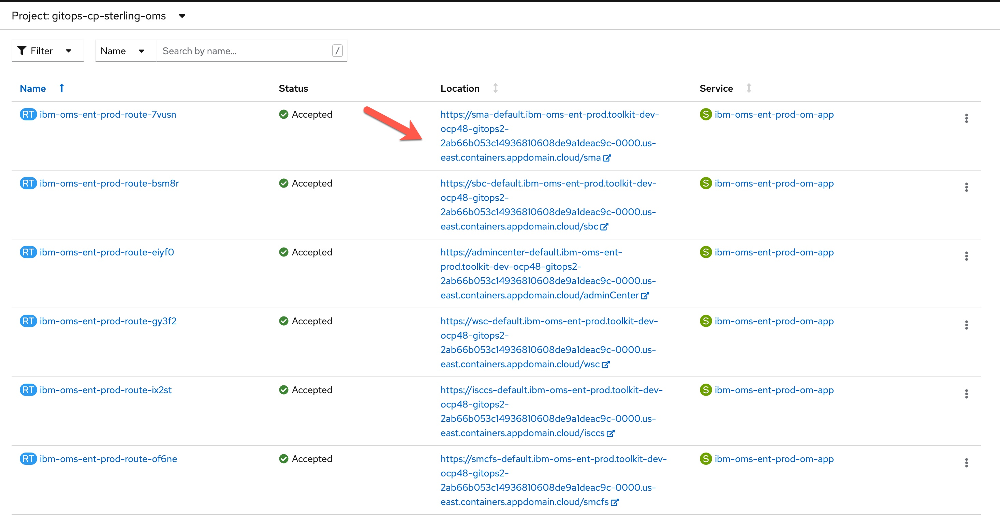
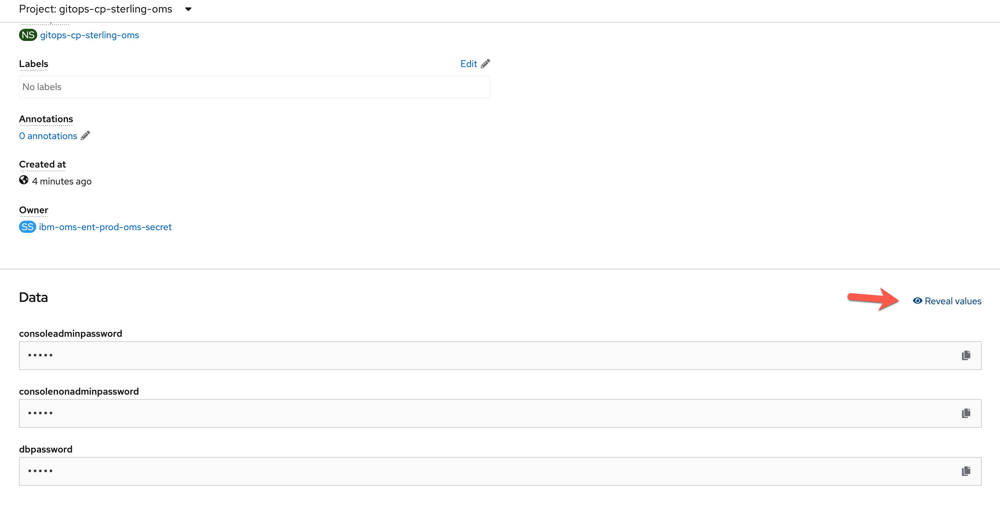

# Sterling Order Manager Software(OMS)  for AWS, Azure, and IBM Cloud

### Change Log

- **05/2022** - Initial Release

> This collection of Sterling OMS terraform automation layers has been crafted from a set of  [Terraform modules](https://modules.cloudnativetoolkit.dev/) created by the IBM GSI Ecosystem Lab team part of the [IBM Partner Ecosystem organization](https://www.ibm.com/partnerworld/public?mhsrc=ibmsearch_a&mhq=partnerworld). Please contact **Matthew Perrins** _mjperrin@us.ibm.com_, **Sean Sundberg** _seansund@us.ibm.com_,  or **Andrew Trice** _amtrice@us.ibm.com_ or **Bala Sivasubramanian** _bala@us.ibm.com_ for more details or raise an issue on the repository.

The automation will support the installation of Sterling OMS on three cloud platforms (AWS, Azure, and IBM Cloud).  

### Target Infrastructure

The Sterling  automation assumes you have an OpenShift cluster already configured on your cloud of choice. The supported managed options are [ROSA for AWS](https://aws.amazon.com/rosa/), [ARO for Azure](https://azure.microsoft.com/en-us/services/openshift/) or [ROKS for IBM Cloud ](https://www.ibm.com/cloud/openshift).

Before you start to install and configure Sterling OMS, you will need to identify what your target infrastructure is going to be. You can start from scratch and use one of the pre-defined reference architectures from IBM or bring your own.


### Reference Architectures


The reference architectures are provided in three different forms, with increasing security and associated sophistication to support production configuration. These three forms are as follows:


- **Quick Start** - a simple architecture to quickly get an OpenShift cluster provisioned

- **Standard** - a standard production deployment environment with typical security protections, private endpoints, VPN server, key management encryption, etc

- **Advanced** - a more advanced deployment that employs network isolation to securely route traffic between the different layers.


For each of these reference architecture, we have provided a detailed set of automation to create the environment for the software. If you do not have an OpenShift environment provisioned, please use one of these. They are optimized for the installation of this solution.

Note:  [Sterling OMS system requirements](https://www.ibm.com/docs/en/order-management-sw/10.0?topic=installing-system-requirements) recommend at least 3 worker nodes, with minimum 16vCPU per node and minimum 64 GB RAM per done (128 GB RAM is recommended).

| Cloud Platform                          | Automation and Documentation                                                                                                                                                                                                                                              |   
|-----------------------------------------|---------------------------------------------------------------------------------------------------------------------------------------------------------------------------------------------------------------------------------------------------------------------------|
| [IBM Cloud](https://cloud.ibm.com)      | [IBM Cloud Quick Start](https://github.com/IBM/automation-ibmcloud-infra-openshift) <br /> [IBM Cloud Standard - Coming soon](https://github.com/IBM/automation-ibmcloud-infra-openshift) <br /> [IBM Cloud Advanced - Coming soon](https://github.com/IBM/automation-ibmcloud-infra-openshift) |  
| [AWS](https://aws.amazon.com/)          | [AWS Quick Start - Coming soon](https://github.com/IBM/automation-aws-infra-openshift) <br /> [AWS Standard - Coming soon](https://github.com/IBM/automation-aws-infra-openshift) <br /> [AWS Advanced - Coming soon](https://github.com/IBM/automation-aws-infra-openshift) |
| [Azure](https://portal.azure.com/#home) | [Azure Quick Start](https://github.com/IBM/automation-azure-infra-openshift) <br /> [Azure Standard - Coming soon](https://github.com/IBM/automation-azure-infra-openshift) <br /> [Azure Advanced - Coming soon](https://github.com/IBM/automation-azure-infra-openshift) |                                                                                             | 
| Bring Your Own Infrastructure           | You will need a cluster with at least 16 CPUs and 64 GB of memory per node and at least 3 nodes to support storage and IBM Cloud Paks.                                                                                                                                    |                                                                               


### Getting Started


Within this repository you will find a set of Terraform template bundles that embody best practices for provisioning the Data Foundation in multiple cloud environments. This `README.md` describes the SRE steps required to provision the Data Foundation software.


This suite of automation can be used for a Proof of Technology environment, or used as a foundation for production workloads with a fully working end-to-end cloud-native environment. The software installs using **GitOps** best practices with [**Red Hat Open Shift GitOps**](https://docs.openshift.com/container-platform/4.8/cicd/gitops/understanding-openshift-gitops.html)


## Deploying Sterling OMS


The following instructions will help you install Sterling OMS into AWS, Azure, and IBM Cloud OpenShift Kubernetes environment.


### Licenses and Entitlements

Details on Sterling OMS licensing available at https://www.ibm.com/docs/en/order-management-sw/10.0?topic=planning-software-license-upgrade-instructions

### Obtaining your IBM entitlement API key
You must have your IBM entitlement API key to access images in the IBM Entitled Registry.

After you purchase Cloud Pak for Data, an entitlement API key for the software is associated with your My IBM account. You need this key to complete the Sterling OMS installation. To obtain the entitlement key, complete the following steps:
* Log in to [Container software library on My IBM](https://myibm.ibm.com/products-services/containerlibrary) with the IBM ID and password that are associated with the entitled software.
* On the **Get entitlement key** tab, select **Copy key** to copy the entitlement key to the clipboard.
* Save the API key for later in this installation.


### Sterling OMS Layered Installation

The Sterling OMS automation is broken into what we call layers of automation or bundles. The bundles enable SRE activities to be optimized. The automation is generic between clouds other than configuration storage options, which are platform specific.

| BOM ID | Name                                                                                                                                                                                                                                                           | Description                                                                                                                                                | Run Time |
|--------|----------------------------------------------------------------------------------------------------------------------------------------------------------------------------------------------------------------------------------------------------------------|------------------------------------------------------------------------------------------------------------------------------------------------------------|----------|
| 200    | [200 - OpenShift Gitops](./200-openshift-gitops)                                                                                                                                                                                                               | Set up OpenShift GitOps tools in an OpenShift cluster. This is required to install the software using gitops approaches.                                   | 10 Mins  |
| 210    | [210 - IBM Portworx Storage](./210-ibm-portworx-storage) | Use this automation to deploy a storage solution for your cluster.  | 10 Mins  |
| 800    | [800 - IBM Sterling OMS](./800-ibm-sterling-oms)                                                                                                                                                                                   | Install IBM Sterling Order Manager Software                                                                                                     | 60 Mins   |


> At this time the most reliable way of running this automation is with Terraform in your local machine either through a bootstrapped container image or with native tools installed. We provide a Container image that has all the common SRE tools installed. [CLI Tools Image,](https://quay.io/repository/ibmgaragecloud/cli-tools?tab=tags) [Source Code for CLI Tools](https://github.com/cloud-native-toolkit/image-cli-tools)


## Installation Steps


Before you start the installation please install the pre-req tools on your machine.


> We have tested this on a modern Mac laptop. We are testing on M1 machines. You will need to setup the tools natively in your M1 Mac OS and not run the `launch.sh` script.


### Pre-Req Setup


Please install the following Pre-Req tools to help you get started with the SRE tasks for installing Data Foundation into an existing OpenShift Cluster on AWS, Azure, or IBM Cloud.


Pre-requisites:

- Check you have a valid GitHub ID that can be used to create a repository in your own organization [GitHub]( https://github.com/) or GitHub Enterprise account.

- Install a code editor, we recommend [Visual Studio Code](https://code.visualstudio.com/)

- Install [Brew](https://brew.sh/)

- If allowed by your corporate policy, install [Docker Desktop](https://www.docker.com/products/docker-desktop/).  If not allowed, install [Colima](https://github.com/abiosoft/colima), a replacement for Docker Desktop


Ensure you have the following before continuing:

- Github account exists

- A Github [token](https://docs.github.com/en/enterprise-server@3.3/authentication/keeping-your-account-and-data-secure/creating-a-personal-access-token) is available with permissions set to create and remove repositories

- You are able to login to the OpenShift cluster and obtain an OpenShift login token

- Cloud Pak entitlement key, this can be obtained from visiting the [IBM Container Library](https://myibm.ibm.com/products-services/containerlibrary) as described above.


### Installing Sterling OMS


The installation process will use a standard GitOps repository that has been built using the Modules to support Sterling OMS installation. The automation is consistent across three cloud environments AWS, Azure, and IBM Cloud.


#### (optional) Set up the container environment

A container image is used to provide a consistent runtime environment for the automation that includes all the required tools. The provided container image supports hosts with either amd64 and amd64 architectures. If you do not have a container runtime already (e.g. Docker Desktop or podman), **Colima** can be used. The steps to install and start **Colima** on MacOS are provided below:

1. Install **Colima** and the **docker** cli. This only needs to be done once.

    ```shell
    brew install colima docker
    ```

2. Start **Colima**. This needs to be done after each time the computer is restarted. (The first time **Colima** is started takes longer to prepare the environment.)

    ```shell
    colima start
    ```


#### Set up environment credentials


1. First step is to clone the automation code to your local machine. Run this git command in your favorite command line shell.

    ```
    git clone https://github.com/IBM/.git
    ```

2. Navigate into the `automation-sterling-oms` folder using your command line.

   a.	The README.md has a comprehensive instructions on how to install this into other cloud environments than TechZone. This document focuses on getting it running in a TechZone requested environment.

3. Next you will need to set-up your credentials.properties file. This will enable a secure deployment to your cluster.

    ```shell
    cp credentials.template credentials.properties
    code credential.properties
    ```

   In the `credentials.properties` file you will need to populate the values for your deployment.

    ```text
    ## Add the values for the Credentials to access the OpenShift Environment
    ## Instructions to access this information can be found in the README.MD
    ## This is a template file and the ./launch.sh script looks for a file based on this template named credentials.properties
    
    ## gitops_repo_host: The host for the git repository
    TF_VAR_gitops_repo_host=github.com
    ## gitops_repo_username: The username of the user with access to the repository
    TF_VAR_gitops_repo_username=
    ## gitops_repo_token: The personal access token used to access the repository
    TF_VAR_gitops_repo_token=
    
    ## TF_VAR_server_url: The url for the OpenShift api server
    TF_VAR_server_url=
    ## TF_VAR_cluster_login_token: Token used for authentication to the api server
    TF_VAR_cluster_login_token=
    
    ## TF_VAR_entitlement_key: The entitlement key used to access the IBM software images in the container registry. Visit https://myibm.ibm.com/products-services/containerlibrary to get the key
    TF_VAR_entitlement_key=
    
    ```

   > ⚠️ Do not wrap any values in `credentials.properties` in quotes


4. Add your Git Hub username and your Personal Access Token to `gitops_repo_username` and `gitops_repo_token`

5. From you OpenShift console click on top right menu and select Copy login command and click on Display Token

6. Copy the API Token value into the `cluster_login_token` value

7. Copy the Server URL into the `server_url` value, only the part starting with https

8. Copy the entitlement key, this can be obtained from visiting the [IBM Container Library](https://myibm.ibm.com/products-services/containerlibrary) and place it in the `entitlement_key` variable.

#### Configure Storage

##### Deploying on IBM Cloud (Portworx or ODF)

1. Provide the IBM Cloud API Key for the target IBM Cloud account as the value for `TF_VAR_ibmcloud_api_key`


#### Configure the automation


##### Set up the automation workspace


1. (Optional) If your corporate policy does not allow use of Docker Desktop, then you need to install **Colima** as an alternative

    ```
    brew install colima
    colima start
    ```


2. We are now ready to start installing Data Foundation, run the `launch.sh` command, make sure you are in the root of the `automation-data-foundation` repository

   ```
   ./launch.sh
   Cleaning up old container: cli-tools-WljCg
   Initializing container cli-tools-WljCg from quay.io/cloudnativetoolkit/cli-tools:v1.1
   Attaching to running container...
   /terraform $
   ```


3. **launch.sh** will download a container image that contains all the command line tools to enable easy installation of the software. Once it has downloaded, it will mount the local file system and exec into the container for you to start running commands from within this custom container.


> we expect partners and clients will use their own specific **Continuous Integration** tools to support this the IBM team has focused on getting it installed in the least complicated way possible


4. Next we need to create a workspace to run the Terraform automation.  Below you can see the parameters to configure your workspace for terraform execution.

    ```
    /terraform $ ./setup-workspace.sh -h
    Creates a workspace folder and populates it with automation bundles you require.
    
    Usage: setup-workspace.sh
    options:
    -p     Cloud provider (aws, azure, ibm)
    -s     Storage (portworx or odf)
    -n     (optional) prefix that should be used for all variables
    -x     (optional) Portworx spec file - the name of the file containing the Portworx configuration spec yaml
    -c     (optional) Self-signed Certificate Authority issuer CRT file
    -h     Print this help
    ```

    You will need to select the cloud provider of your choice, storage option, and if desired, a prefix for naming new resource instances on the Cloud account.  If you are using Azure, you will need a Portworx spec file name (as described above), and if your cluster is using a self-signed SSL certificate, you will need a copy of the issuer cert and the file name.

    > ⚠️ At this time, only IBM Cloud and Azure are supported, but support for AWS will be released in the coming days.

5. Run the command `setup-workspace.sh -p ibm -s portworx -n df` and include optional parameters as needed.

    ```
    /terraform $ ./setup-workspace.sh -p ibm -s portworx -n df
    Setting up workspace in '/terraform/../workspaces/current'
    *****
    Setting up workspace from '' template
    *****
    Setting up automation  /workspaces/current
    /terraform
    Setting up current/200-openshift-gitops from 200-openshift-gitops
      Skipping 210-aws-portworx-storage because it does't match ibm
      Skipping 210-azure-portworx-storage because it does't match ibm
    Setting up current/210-ibm-odf-storage from 210-ibm-odf-storage
    Setting up current/210-ibm-portworx-storage from 210-ibm-portworx-storage
    Setting up current/800-ibm-sterling-oms from 800-ibm-sterling-oms
    move to /workspaces/current this is where your automation is configured
    ```
6. The default `terraform.tfvars` file is symbolically linked to the new `workspaces/current` folder so this enables you to edit the file in your native operating system using your editor of choice.

7. Edit the default `terraform.tfvars` file this will enable you to setup the GitOps parameters.

The following you will be prompted for and some suggested values.

| Variable      | Description                                               | Suggested Value                                       |
| -----------   |-----------------------------------------------------------|-------------------------------------------------------
| gitops-repo_host | The host for the git repository.                          | github.com                                            |
| gitops-repo_type | The type of the hosted git repository (github or gitlab). | github                                                |
| gitops-repo_org | The org/group/username where the git repository exists    | github userid or org - if left blank the value will default to your username                                 |
| gitops-repo_repo | The short name of the repository to create                | oms-gitops                                  |

The `gitops-repo_repo`, `gitops-repo_token`, `entitlement_key`, `server_url`, and `cluster_login_token` values will be loaded automatically from the credentials.properties file that was configured in an earlier step.


8. The `cp4d-instance_storage_vendor` variable should have already been populated by the `setup-workspace.sh` script. This should have the value `portworx` or `ocs`, depending on the selected storage option.

9. You will see that the `repo_type` and `repo_host` are set to GitHub you can change these to other Git Providers, like GitHub Enterprise or GitLab.

10. For the `repo_org` value set it to your default org name, or specific a custom org value. This is the organization where the GitOps Repository will be created in. Click on top right menu and select Your Profile to take you to your default organization.

11. Set the `repo_repo` value to a unique name that you will recognize as the place where the GitOps configuration is going to be placed before Data Foundation is installed into the cluster.

12. You can change the `gitops-cluster-config_banner_text` banner text to something useful for your client project or demo.

13. Save the `terraform.tfvars` file

14. Navigate into the `/workspaces/current` folder

    > ❗️ Do not skip this step.  You must execute from the `/workspaces/current` folder.


##### Manual Deployment

15. You can also deploy each layer manually.  To begin, navigate into the `200-openshift-gitops` folder and run the following commands

    ```
    cd 200-openshift-gitops
    terraform init
    terraform apply --auto-approve
    ```


16. This will kick off the automation for setting up the GitOps Operator into your cluster.  Once complete, you should see message similar to:

    ```
    Apply complete! Resources: 78 added, 0 changed, 0 destroyed.
    ```

17. You can check the progress by looking at two places, first look in your github repository. You will see the git repository has been created based on the name you have provided. The Sterling OMS install will populate this with information to let OpenShift GitOps install the software. The second place is to look at the OpenShift console, Click Workloads->Pods and you will see the GitOps operator being installed.


18. Change directories to the `210-ibm-portworx-storage` folder and run the following commands to deploy portworx storage into your cluster:

    ```
    cd 210-ibm-portworx-storage
    terraform init
    terraform apply --auto-approve
    ```

    > This folder will vary based on the platform and storage options that you selected in earlier steps. 
    
    Storage configuration will run asynchronously in the background inside of the Cluster and should be complete within 10 minutes.

19. Change directories to the `800-ibm-sterling-oms` folder and run the following commands to deploy entitlements into your cluster:

    ```
    cd ../800-ibm-sterling-oms
    terraform init
    terraform apply --auto-approve
    ```

    > This step install IBM Sterling Order Manager Software


20. You can check the progress of the deployment by opening up Argo CD (OpenShift GitOps).  From the OpenShift user interface, click on the Application menu 3x3 Icon on the header and select **Cluster Argo CD** menu item.)

    This process will take between 15 and 25 minutes to complete.  

##### Access the Sterling OMS Deployment

21. Once deployment is complete, go back into the OpenShift cluster user interface and navigate to view `Routes` for the `gitops-sterling-oms` namespace.  Here you can see the URL to the deployed Sterling OMS instance.  Open this url in a new browser window.

    

22. Navigate to `Secrets` in the `gitops-sterling-oms` namespace, and find the `ibm-oms-ent-prod-oms-secret` secret.  Copy the value of `admin_password` key inside of that secret.
    
 

23. Go back to the Sterling OMS instance that you opened in a separate window.  Log in using the username `admin` with the password copied in the previous step.


## Summary

This concludes the instructions for installing *Sterling OMS* on AWS, Azure, and IBM Cloud.


## Uninstalling & Troubleshooting

Please refer to the [Troubleshooting Guide](./TROUBLESHOOTING.md) for uninstallation instructions and instructions to correct common issues.

If you continue to experience issues with this automation, please [file an issue](https://github.com/IBM/sterling-oms/issues) or reach out on our [public Dischord server](https://discord.com/channels/955514069815808010/955514069815808013).


## How to Generate this repository from the source Bill of Materials.


This set of automation packages was generated using the open-source [`isacable`](https://github.com/cloud-native-toolkit/iascable) tool. This tool enables a [Bill of Material yaml](https://github.com/cloud-native-toolkit/automation-solutions/tree/main/boms/software/oms) file to describe your software requirements. If you want up stream releases or versions you can use `iascable` to generate a new terraform module.


> The `iascable` tool is targeted for use by advanced SRE developers. It requires deep knowledge of how the modules plug together into a customized architecture. This repository is a fully tested output from that tool. This makes it ready to consume for projects.
