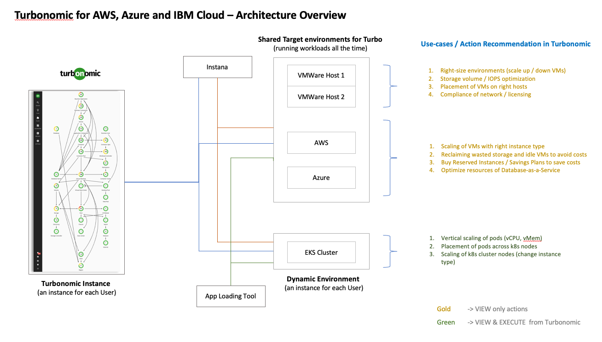

# Turbonomic - Bill of Materials

The folder contains the BOMs for the Turbonomic Automation for AWS, Azure and IBM Cloud solutions.



## Overview
Bill of Materials is the raw ingredients for building the automation. This is the `YAML` documentation that enables automation to be created to deploy the modules using GitOps within an AWS ROSA, Azure ARO, IBM Cloud ROKS cluster.

## Bill of Materials

List of BOMs for Turbonomic, there is a generic one for on premise. You will need to make sure the Storage classes are defined. The others have specific setting to enable install into the cloud platform with the correctly specified storage classes.

- [Turbonomics for Generic Install](./400-turbo-bom.yaml)
- [Turbonomics for AWS](./400-turbo-bom.yaml)
- [Turbonomics for Azure](./400-turbo-bom.yaml)
- [Turbonomics for IBM Cloud](./400-turbo-bom.yaml)

### Validated Open-Source Release

Before you attempt to generate and modify your BOM content,  if you want a tested and validated version you can go directly to the Open-Source release of the generated content. 
- [Turbonomic for AWS, Azure and IBM Cloud](https://github.com/IBM/automation-turbonomic) 

Follow the installation instructions from the above link to deploy using a package version of **Terraform**

If you want to download the latest version from the *Solution Builder* use the [Ascent](https://ascent.openfn.co) tool login with your IBM ID. Navigate to Solution view and click *Download* on the *Turbonomic for AWS, Azure and IBM Cloud* tile. 

## Generating Automation

If you want to get the latest upstream content you can generate the latest automation using the steps below:

### Install IasCable

To install the latest version of [iascable](https://github.com/cloud-native-toolkit/iascable/blob/main/README.md) into `/usr/local/bin`, run the following:

```shell
curl -sL https://raw.githubusercontent.com/cloud-native-toolkit/iascable/main/install.sh | sh
```
### Generate Command

To generate from this cloned repository to a folder called `boms` in your root directory use the following command. We are assuming you have installed `brew` for MacOS at this point. 

```shell
brew install tree
mkdir ~/automation
```

Pick the BOM you want to generate for the platform you are targeting.
```
cd boms/software/turbonomic
iascable build -i ./400-400-turbo-bom.yaml -o ~/automation

    Name: 400-gitops-ocp-turbonomic
    Loading catalog from url: https://modules.cloudnativetoolkit.dev/index.yaml
    Writing output to: ~/automation
```

You can see the output of the generation 

```bash
tree ~/automation/
```

You will see this generated content. You can use the [README.md](./files/README.md) in the `files` folder understand how to perform the specific installation.

```bash
~/automation/
├── 400-gitops-ocp-turbonomic
│   ├── apply.sh
│   ├── bom.yaml
│   ├── dependencies.dot
│   ├── destroy.sh
│   └── terraform
│       ├── 400-gitops-ocp-turbonomic.auto.tfvars
│       ├── docs
│       │   ├── argocd-bootstrap.md
│       │   ├── gitops-namespace.md
│       │   ├── gitops-ocp-turbonomic.md
│       │   ├── gitops-repo.md
│       │   ├── ocp-login.md
│       │   ├── olm.md
│       │   └── sealed-secret-cert.md
│       ├── main.tf
│       └── variables.tf
└── launch.sh
`
```

### How to run the generated automation for Turbonomic

To start read the instructions for configuring your automation from this [README.md](./files/README.md). Then navigation to your output directory `~/automation/400-gitops-ocp-turbonomic` and follow those instructions.  


