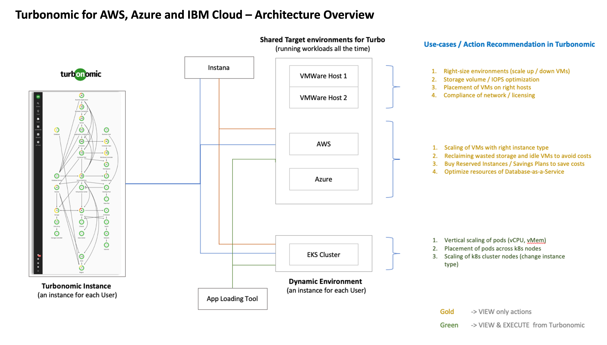

# Turbonomic - Bill of Materials

This folder contains the Bill of Materials (*BOMs*) for the Turbonomic Automation for AWS, Azure and IBM Cloud multi cloud deployments.

Below you can see how Turbonomic can help your organisation introspect the costs and resources of your complex cloud enviroments.



## Overview

BOMs are the raw ingredients for building automation for complex cloud installations. They are described in `YAML` and  enable automation to be created to deploy infrastructure and software into cloud environments.


GitOps within an AWS ROSA, Azure ARO, IBM Cloud ROKS cluster.

## Bill of Materials

Below is a list of BOMs for Turbonomic. There is a generic one for on-premise. You will need to make sure the Storage classes are defined. All others have specific settings to enable install into the cloud platform with the correctly specified storage classes.

- [200 OpenShift GitOps](./200-openshift-gitops.yaml)
- [202 IBM Cloud Storage Ckass](./202-turbonomic-ibmcloud-storage-class.yaml)
- [250 Turbonomic for Multi Cloud](./250-turbonomic-multicloud.yaml)

### Validated Open-Source Release

Before you attempt to generate and modify your BOM content, to get a tested and validated version, you can go directly to the Open-Source release of the generated content. 
- [Turbonomic for AWS, Azure and IBM Cloud](https://github.com/IBM/automation-turbonomic) 

Follow the installation instructions from the above link to deploy using a package version of the **Terraform** automation.

If you want to download the latest version from the *Solution Builder*, use the [Ascent](https://ascent.openfn.co) tool and  login with your IBM ID. Navigate to Solution view and click *Download* on the *Turbonomic for AWS, Azure and IBM Cloud* tile. 

## Generating Automation

To get the latest upstream content, see the steps below:

### Install IasCable

First you will need to install the latest version of [iascable](https://github.com/cloud-native-toolkit/iascable/blob/main/README.md) into your `/usr/local/bin` folder. You can do this by running the following cli command. This tool converts BOMs into automation.

```shell
curl -sL https://raw.githubusercontent.com/cloud-native-toolkit/iascable/main/install.sh | sh
```
### Generate Command

To generate from a BOM , clone this repository onto your machine or trusted environment. You will create an `automation` folder to store the output of the generation. Use the the following commands.

> We are assuming you have installed [brew]() for MacOS at this point 

Run the following commands to turn the BOM into Automation. Install a simple `tree` tool and create your output directory.

```shell
brew install tree
mkdir ~/automation
```

Pick the BOM you want to generate for the platform you are targeting.
```
cd boms/software/turbonomic
iascable build -i ./250-turbonomic-multicloud.yaml.yaml -o ~/automation

    Name: 250-turbonomic-multicloud
    Loading catalog from url: https://modules.cloudnativetoolkit.dev/index.yaml
    Writing output to: ~/automation
```

You can see the output of the generation:

```bash
tree ~/automation/
```

You will then see this generated content. You can use the [README.md](./files/README.md) in the `files` folder understand to how to perform the specific installation.

```bash
~/automation/
├── 250-turbonomic-multicloud.yaml
│   ├── apply.sh
│   ├── bom.yaml
│   ├── dependencies.dot
│   ├── destroy.sh
│   └── terraform
│       ├── 250-turbonomic-multicloud.auto.tfvars
│       ├── docs
│       │   ├── argocd-bootstrap.md
│       │   ├── gitops-namespace.md
│       │   ├── gitops-ocp-turbonomic.md
│       │   ├── gitops-repo.md
│       │   ├── ocp-login.md
│       │   ├── olm.md
│       │   └── sealed-secret-cert.md
│       ├── main.tf
│       └── variables.tf
└── launch.sh
`
```

### How to run the generated automation for Turbonomic

To start, read the instructions for configuring your automation from this [README.md](./files/README.md). Then navigate to your output directory `~/automation/400-gitops-ocp-turbonomic` and follow those instructions.  

